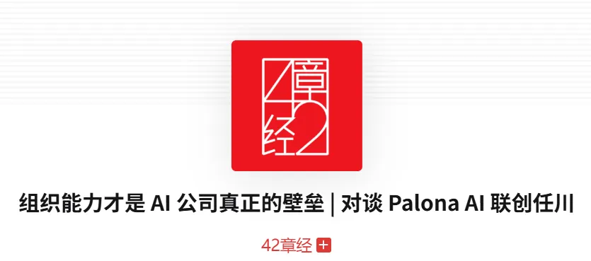

## 

[https://youmind.site/TRwW2atmXUtt2X](https://youmind.site/TRwW2atmXUtt2X)

当G2这样的B2B评论平台因为ChatGPT的兴起而失去80-90%的SEO流量时，我们意识到一个时代正在终结。传统的增长手册——依赖搜索引擎优化、社交媒体投放、付费广告，正在以前所未有的速度失效。与此同时，AI工具的普及让用户开始自建替代方案，直接威胁着SaaS产品的生存根基。

**这篇文章核心讨论的问题**：

<u>在AI重塑用户行为和竞争格局的背景下，产品如何重新构建可持续的增长策略？</u>

本文访谈对象是**Elena Verna，Lovable增长负责人**，拥有15年增长实战经验的硅谷传奇人物。

她曾在7年内从SurveyMonkey初级分析师晋升至增长副总裁，随后担任Dropbox、Miro、Amplitude等知名公司增长顾问。作为Reforge合伙人，Elena创建了多个经典增长课程，被誉为产品驱动增长（PLG）领域的顶级专家。

加入Lovable后，她帮助这家AI原生公司在7个月内实现8000万美元ARR，重新定义了AI时代的增长策略。

# 一、分发优于产品：重新理解增长的本质

**增长的核心从来是分发能力。**

这个判断听起来反直觉，但现实是残酷的：市场上存在数百万个我们从未听说过的优秀产品，它们死于缺乏有效的分发策略。

相反，那些让你每次使用都"掉脑细胞"的产品，却能建立起数十亿美元的商业帝国。原因很简单：它们掌握了分发的密码。

**传统企业软件通过销售团队建立的渠道垄断，消费互联网产品通过算法推荐构建的流量护城河，都是分发能力的体现**。

> "你可以有一个很棒的产品，但如果你没有将分发融入其中，你就会慢慢死去"——Elena强调的这个观点直接挑战了"产品至上"的硅谷神话。

但分发的定义正在发生根本性变化。

过去我们谈论的是如何获取、激活、变现和留存用户的线性漏斗思维。

现在最成功的公司都在构建循环系统——用户的每一个行为都能产生新的获客机会。Dropbox的分享即获客，就是这种循环思维的经典案例：60%的新用户来自现有用户的内容分享行为，而非营销投入。

这种从漏斗到循环的转变，要求产品经理必须在设计每个功能时都考虑：这个功能如何为下一轮增长创造输入？

# 二、传统渠道的系统性崩塌

搜索引擎优化曾经是B2B公司最可靠的增长引擎，但这个基础正在被AI重新定义，用户行为的改变比我们想象的更加迅速和彻底。

当人们习惯了与ChatGPT对话式的信息获取方式后，很难再回到传统的搜索-浏览-筛选模式。

G2平台（企业软件领域的“大众点评”）的数据只是冰山一角。

这种下滑趋势在整个依赖SEO的行业中都在发生，从内容聚合网站到垂直搜索平台，都面临着流量的断崖式下跌。更糟糕的是，社交媒体平台也在收紧对外链的支持力度。

> "算法给予，算法也会夺走"——Elena用这句话概括了社交媒体营销的本质不确定性。

**平台为了提高用户粘性，会主动降低带有外链内容的曝光率。**

这意味着即使你的内容质量很高，也很难通过社交媒体为自己的产品导流。传统的"内容营销+社交分发"的组合策略正在失去效力。

但更深层的威胁来自用户端的变化。

当Lovable这样的AI编程工具让普通用户也能快速构建简单的软件功能时，SaaS产品面临的不再是同行竞争，而是用户的自建替代。

<u>这种"去中介化"趋势正在从简单功能开始，逐步向复杂应用扩展。</u>

# 三、产品即营销：构建内生增长循环

在传统渠道失效的背景下，产品本身必须承担起营销职能，在产品体验中嵌入传播机制。

**最有效的方式是构建用户行为与获客行为的正向循环**。

Lovable的实践提供了一个清晰的范例：他们将超过一半的运营成本投入到免费用户的体验优化上，但这笔支出被定义为营销预算而非成本中心。

逻辑很简单：与其让Google从广告费中获利，不如直接补贴用户体验，让产品本身成为最好的营销工具。

> "我们宁愿把钱给我们的客户，也不愿让Google变得更富有"

这种策略的核心是将免费增值模式从获客工具转变为品牌建设工具。当用户在使用过程中感受到超预期的价值时，他们自然会成为产品的传播者。

**关键是要在产品的前两分钟体验中植入"可分享的惊喜时刻"。**

但这种策略也有明显的适用边界：<u>它要求产品具备足够的差异化价值，且边际成本可控。</u>

对于那些同质化严重或单次服务成本较高的产品，这种模式可能并不适用。

# 四、速度即壁垒：AI原生团队的组织创新

在产品功能日趋同质化的时代，**交付速度正在成为新的竞争壁垒。**

Lovable通过构建"AI原生员工"体系，实现了每天甚至每小时的产品更新频率，这种速度优势正在转化为市场地位。

传统软件公司的年度或季度发布节奏已经无法适应当前的竞争环境。用户期望的响应速度在加快，市场窗口期在缩短，这要求团队必须具备快速试错和迭代的能力。

Lovable的解决方案是打破职能边界，**让工程师直接承担营销职责，让每个员工都能独立完成从想法到上线的完整流程**。

此处推荐一期播客：<https://mp.weixin.qq.com/s/FpKYbo3ptY0NiI1GoXpAyA>

> "我们有工程师在做营销，他们发布功能，推出产品，并对结果负责"——这种角色模糊化实际上提高了整体效率。

这种组织模式的前提是员工必须具备跨领域的AI工具使用能力。

当一个工程师可以用AI快速生成营销文案、设计素材和数据分析报告时，传统的部门协作流程就变成了效率瓶颈。

**关键是要给员工足够的自主权和容错空间，让他们敢于承担端到端的责任**。

但这种模式也有明显的规模限制。对于大型组织而言，完全去中心化可能导致品牌一致性和合规风险。

更现实的做法是在小团队内部实现高度自主，在团队间保持必要的协调机制。

# 五、数据积累与生态位竞争

**在功能同质化的趋势下，数据积累正在成为新的差异化来源。**

但这里的数据不是简单的用户行为记录，而是能够改善产品体验或提高用户粘性的核心资产。

Salesforce切断Slack数据对第三方的开放就是这种策略的典型体现。

- Salesforce在2021年以277亿美元收购了Slack

- 收购后，Salesforce开始限制或切断第三方公司对Slack数据的访问权限

- 这意味着其他企业软件无法再轻易获取和使用Slack中的对话、文件、用户行为等数据

<u>数据护城河的构建需要长期视角。</u>

早期阶段，产品需要通过开放和集成来获取用户，但随着数据价值的显现，适度的封闭策略可能更有利于竞争地位的巩固。

关键是要识别哪些数据对用户价值最大，哪些数据对竞争对手威胁最大。

> "没有Slack信息的企业内部搜索还能叫什么？什么都不是"

但数据策略也需要平衡用户利益和竞争优势。过度的数据封锁可能导致用户流失，而过度的开放则可能被竞争对手利用。

最佳实践是建立分层的数据开放策略：核心数据保持封闭，边缘数据适度开放，通过API控制访问权限和使用场景。

除了数据护城河，生态系统集成也是重要的防御策略。

**通过与关键平台的深度集成，产品可以获得稳定的流量来源和用户粘性**。

OpenAI最近推出的应用商店就提供了这样的机会，关键是要具备先发优势和持续投入能力。

# 六、人格化品牌与创作者经济

在算法推荐和付费广告效果下降的背景下，基于人格化的品牌建设正在重新获得重视。

**这种策略的核心是让用户与具体的人而非抽象的品牌建立连接，从而获得更高的信任度和传播效果。**

Lovable CEO Anton的社交媒体实践提供了一个可复制的模板：

从零开始，通过持续的专业内容输出，在10个月内建立起数百万级的影响力。这种有机增长的效果往往超过同等投入的付费广告，且具有更强的持续性。

> "这是营销人员梦寐以求的效果，但你可以通过自己的团队来实现"——人格化营销的ROI优势正在被更多公司认识到。

但人格化品牌也有明显的风险和限制。

对于大型公司而言，法务合规是主要障碍；对于创始人而言，个人精力和专业能力是主要瓶颈。

**更现实的做法是建立多层次的人格化矩阵：创始人负责战略观点，产品负责人负责功能解读，技术负责人负责实现细节。**

创作者经济的兴起也为B2B产品提供了新的营销渠道。

YouTube、TikTok、Instagram上的垂直领域创作者拥有高度精准的受众群体，通过与他们的合作可以实现更高效的用户获取。

<u>关键是要识别真正具有影响力的创作者，而非仅仅关注粉丝数量。</u>

# 七、新兴渠道的机会窗口

技术平台的每一次重大更新都会创造新的分发机会。

OpenAI应用商店的推出就是这样一个窗口期——它可能成为下一个Google搜索级别的流量入口，也可能只是昙花一现的实验。

**关键是要具备快速试错的能力和资源投入的决心。**

新渠道的特点是竞争相对较少，获客成本相对较低，但也伴随着更高的不确定性。

最佳策略是小规模试点，快速验证效果，一旦发现机会就迅速扩大投入。同时要保持对多个新兴渠道的关注，避免过度依赖单一渠道。

平台化思维在这里变得尤为重要。与其被动等待新渠道的出现，不如主动构建自己的分发网络。

通过API开放、开发者生态、合作伙伴计划等方式，让其他产品成为自己的分发渠道。

这种策略需要更长的建设周期，但一旦成功就具有更强的防御性。

# 参考与延展

- 资料来源：本文基于Lovable增长负责人Elena Vega的演讲记录整理