今天这篇文章来自 2025 年 Atlassian 联合创始人兼 CEO Mike Cannon-Brookes 的深度访谈。

访谈的背景是 Atlassian 正处于一个转折点：

公司刚刚宣布将于 2025 年彻底终止本地部署软件，全面转向云服务，同时推出基于 AI 的新产品 Rovo，并完成了对 Browser Company 的收购。

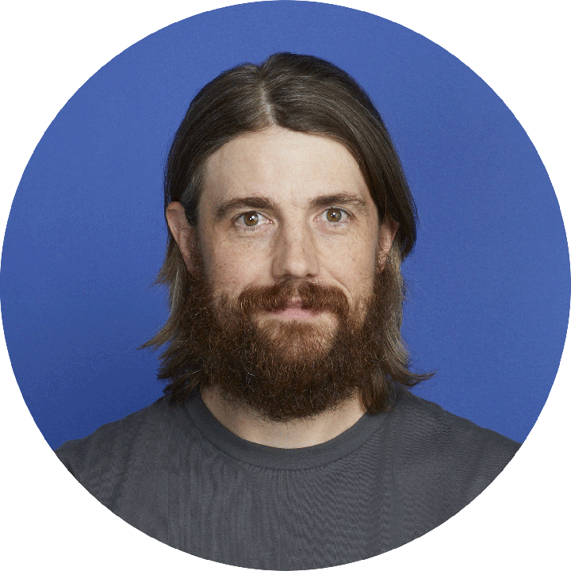

Mike Cannon-Brookes 于 2002 年与 Scott Farquhar 共同创立 Atlassian。

Atlassian 从最初 800 美元定价的 Jira 项目管理工具，发展成为拥有 Confluence、Loom 等 20 多款产品的企业协作平台，服务**超过 85%的财富 500 强企业**，2015 年 IPO 时市值达到数十亿美元。

并且 Atlassian 在 2015 年上市前几乎没有接受过任何外部资本，2010 年 Accel Partners 的 6000 万美元投资最终获得了**约 300 倍的回报。**

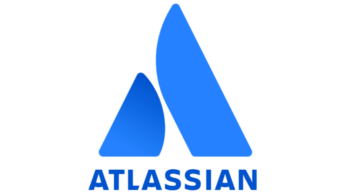

本文将讨论以下问题：

- **在企业软件领域，一家没有销售团队、没有风投支持、地处澳大利亚的公司，如何通过自助式销售模式成长为行业巨头？**

- **在 AI 可能"减少席位数"的威胁下，为什么 Atlassian 认为这是"过去 25 年最好的事情"？**

- **F1赛事的参与，是如何帮助Atlassian 实现GTM创新？**

# Atlassian 的起点

Atlassian 的起源故事带有强烈的反叛色彩。

2002 年，Cannon-Brookes 和 Scott Farquhar 刚刚大学毕业，他们的同学中有 10 人进入 IBM 做咨询，另有 10 人进入 PwC，毕业生起薪是 47600 美元。

但两人在实习期间的经历让他们对传统职业道路产生了深刻的抗拒。

Scott 曾在一家大公司花 6 个月时间挨个电脑安装 Windows 98，Cannon-Brookes 则在 Nortel Bay Networks 整理满屋子的网络设备和路由器。

**如果这就是未来的工作，那实在太糟糕了。**

> "我们字面意义上就是不想找一份真正的工作。"

于是 Cannon-Brookes 向几个朋友发了一封邮件："我真的不想找份正经工作，我们为什么不创办一家公司试试呢？"

他们最初计划做客户服务和咨询，公司名字 Atlassian 来自希腊神话中的泰坦巨人 Atlas，他的惩罚是站在 Atlas 山顶托举天空，两人认为这是"服务"的象征。

但仅仅 6 个月后，他们就意识到<u>咨询是一个糟糕的商业模式</u>。

客户每小时支付 350 美元让他们回答问题，完全不可扩展，而且要在各种奇怪的时间工作。

在做咨询的同时，他们为自己开发了三个工具：一个<u>知识库工具</u>、一个<u>邮件归档工具</u>（这样两人可以看到彼此的邮件），以及<u>一个用于处理问题和任务的工具</u>——**这就是后来的 Jira**。

这些工具最初只是为了提高自己的工作效率，但他们把 Jira 发布到网站上，想着也许其他做咨询的人也会需要。

没想到，这个决定改变了一切。

当 Jira 开始获得外部用户的关注时，他们将所有精力投入其中。

他们为 Jira 制定了一个激进的定价策略：**800 美元——无限用户、无限使用、永久授权，一次性付费。**

这个定价策略依赖两个关键判断：

**第一，互联网将改变软件分发方式**：在 2002 年软件还靠 CD 分发，而 Atlassian 直接将软件变成 ZIP 文件放在网站上供人下载，省掉了所有物理分发成本。

**第二，开源软件将大幅降低开发成本**：通过大量使用开源库，他们只需编写 5%的代码，就能在数千万行开源代码基础上构建出强大的产品。

第一个客户是美国航空公司，当他们早上看到地上躺着一张写有 800 美元和信用卡号的传真时，惊讶地发现这家公司从未联系过他们，没有发过邮件、没有寻求客户服务、没有在 IRC 频道里提问，**完全是自主购买**。

这种增长完全依靠自助式销售模式驱动，没有销售人员、没有差旅、没有客户拜访。

**软件"被购买，而非被销售"。**

# 自助式销售的必然性（PLG）

Atlassian 的商业模式创新与澳大利亚的现实经济紧密相关。

作为一个远离世界主要市场的前殖民地国家，澳大利亚要赚钱必须出口产品。

羊毛成为第一个成功的出口产品，因为它重量轻、易保存，可以经受漫长的木船航程运到欧洲。

> "如果我们要赚钱，就必须面向海外市场，不可能靠澳大利亚人购买我们的软件。"

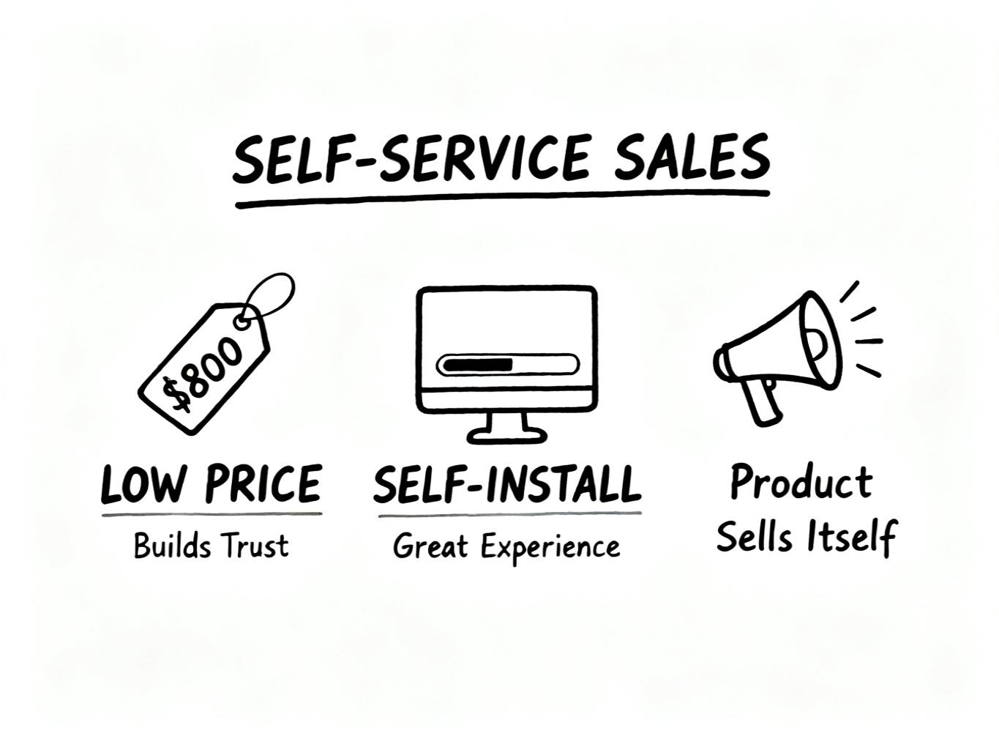

这种思维决定了 Atlassian 的商业模式必须具备几个特征。

**第一，价格必须足够低以克服信任障碍**。800 美元的定价不仅是基于成本计算，更是为了让远在瑞典或伦敦的客户愿意在没见过面的情况下购买。

**第二，产品必须完全可自助安装**。<u>他们在文档和安装体验上投入了大量时间</u>，因为没有人能飞到客户所在地提供支持。

**第三，软件必须自我销售**。没有销售团队意味着**产品本身的价值主张必须极其清晰**。

数十万人每周访问网站、试用软件，其中一部分会留下来，一部分会在大型企业内部传播。

> "我们的软件必须被购买，而非被销售。对于 800 美元的产品，我们无法飞到你在瑞典或伦敦的办公室帮你安装。"——这个约束反而成就了 Atlassian 最强大的护城河。

自助式销售模式的成功还得益于澳大利亚特殊的时区和资源限制。

没有硅谷那样丰富的风险投资，没有庞大的本地市场，没有便利的客户拜访条件，所有这些"劣势"都迫使 Atlassian 必须创新。

**他们不得不让产品足够好以至于客户愿意自己尝试，不得不让价格足够低以至于不需要销售流程，不得不让文档足够清晰以至于远程支持成为可能**。

这些"不得不"最终塑造了一种全新的企业软件销售模式，比传统模式效率高出数倍。

2010 年 Accel Partners 投资 6000 万美元时，Atlassian 已经运营了 9 年，完全自给自足。

# 从 Jira 公司到软件公司：Confluence 的风险对冲逻辑

2004 年,Atlassian 推出了第二款产品 Confluence.

Cannon-Brookes 认为这是 Atlassian 历史上"最被低估的时刻"，因为它让公司从"Jira 公司"转变为"软件公司"。

**Confluence 的推出源于一个风险管理策略。**

由于完全自力更生，没有风投的资金缓冲，Atlassian 面临的风险极高。

两位创始人都学过金融和经济学，深知风险投资公司通过投资组合分散风险的策略。

> "我们想要投资组合理论站在我们这边，"
>
> "我们只有一个产品，这在自力更生的情况下风险极高。因此我们的思路是，如果有两个产品，完全失败的概率会降低，其中一个失败了我们也能活下来。"

这个决策在 2004 年显得大胆，因为 Jira 虽然运转良好，年收入约 500 万美元，但资源仍然有限。

启动第二个产品意味着分散已经稀缺的资源。

> "Confluence 时刻改变了业务，因为我们从 Jira 公司变成了软件公司。我们必须学习如何营销软件、如何构建软件，而非如何营销或构建特定产品。"

这种能力的泛化成为后续推出 20 多款产品的基础。

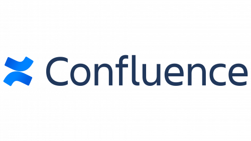

Jira 和 Confluence 的相邻但不同的特性创造了强大的飞轮效应。

两者服务于不同的受众，但有很强的互补性，**购买了其中一个的客户有充分理由购买另一个，无论从哪个产品开始**。

这种"双引擎"模式为 Atlassian 提供了长期动力。

更重要的是，它建立了一种组织文化：

**Atlassian 不是某个单一产品的公司，而是一家持续创造和运营多个产品的软件公司。**

如今他们在 5 个不同类别中拥有 20 到 25 个应用，服务于各种不同的团队。

如果 Atlassian 在推出 Confluence 前等待的时间更长，所有人都会成为"Jira 团队"的一员，**启动第二个产品会变得极其困难。**

**<u>因为组织的身份认同会与单一产品深度绑定，所有流程、激励和思维模式都会围绕这个产品优化。</u>**

相比之下，从第二年就成为多产品公司，让 Atlassian 具备了**跨产品思考和执行的能力**。

这种能力在后来的扩张中证明极其宝贵。

无论是推出 Loom、Rovo 还是收购 Browser Company，公司都能够快速整合和运营新产品线。

# 从纯自助到高接触模式

> **High Touch(高接触）**：
>
> 针对大客户的深度战略合作模式
>
> **Low Touch(低接触）**：
>
> 即创立之初的自助式销售模式

很多人认为 Atlassian 经历了从自助式销售到企业销售的"转型"，但 Cannon-Brookes 强烈反对这种说法。

**他们非常清楚原有模式的优势，在增加新能力时极其小心，确保不会破坏原有引擎**。

如今 Atlassian 运营着两种并行的商业模式，称为"高接触"和"低接触"。

低接触模式本质上与创立之初完全相同：

每周有数十万人访问网站、试用软件，公司通过测量转化率、留存率、收入流和漏斗来优化这个大规模运作的系统。

这个团队的唯一任务就是确保这台机器高效运转，让尽可能多的企业开始使用 Atlassian 软件。

同时，随着客户在企业内部部署越来越多的 Atlassian 产品，**他们开始需要不同类型的关系——更深入、更战略性的合作。**

**触发高接触销售的门槛随时间不断提高。**

最初，当客户支出达到 2 万美元时，Atlassian 就会考虑"也许应该和这些人谈谈"。

如今这个门槛在 5 万到 10 万美元之间。

在这两者之间，还有在线销售和内部销售团队作为过渡层。

这种分层是随着业务规模和客户需求的变化逐步形成的。

**每一层都有清晰的经济模型和服务标准，不会出现资源错配。**

> "我们的进入市场模型持续演进了 20 年，我说'演进'是因为我们非常清楚原有模型的优势，在演变、改变、增加新能力时，都极其小心不要摧毁原有的引擎。"

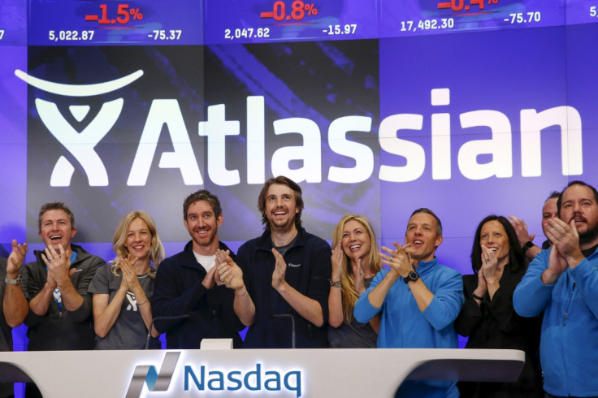

**IPO 成为一个重要的加速点**。

2015 年上市时，Atlassian 只有不到 10 家年支出超过 100 万美元的客户。

如今这个数字超过 500 家，增长了 50 倍。

这种增长不可能没有强大的企业销售团队、客户成功团队以及所有顶级企业销售组织的配套能力。

有趣的是，**高接触客户中的许多人仍然是通过低接触模式开始的。**

以思科为例，最初是一个员工下载了 Jira 来管理自己团队的问题，这个人至今仍在公司，已经工作了 22 到 23 年，而 Atlassian 在思科的座位数已经达到数十万。

这种从自助式开始、逐渐演变为战略合作的路径，让 Atlassian 能够以极低的客户获取成本进入企业，然后随着价值证明和使用扩展而自然增长。

**这种"PLG"策略在 SaaS 行业中已经成为标准模式，但 Atlassian 是最早的实践者之一。**

双轨模式的另一个优势是风险分散。

低接触业务提供了稳定的基础和大量的新客户流入，高接触业务则提供了更高的客户终身价值和更深的护城河。**当市场环境变化时，两者可以互相补充和平衡**。

例如，在经济下行时，大客户可能会削减预算，但大量的中小客户仍会继续自助式购买。

相反，在企业数字化转型加速时，高接触销售可以抓住大额机会。

这种平衡让 Atlassian 的收入增长相对平稳，不会出现剧烈波动。

# 五、为什么 Atlassian 认为 AI 是 25 年来最好的事情

当外界担心 AI 会减少开发者数量、威胁像 Atlassian 这样依赖"席位数"的公司时，Cannon-Brookes 的看法截然相反。

> "这是过去 25 年来发生在我们业务上最好的事情。"

Cannon-Brookes 认为人们对 AI 的负面影响过于具体，而对正面影响估计不足。

他的观点是，如果软件开发成本降低一半，竞争压力会驱使企业用同样多的人做出更高质量的技术，而不是简单裁员。

**AI 是加速器而非替代者，它让人类创造力和问题解决能力成倍增长。**

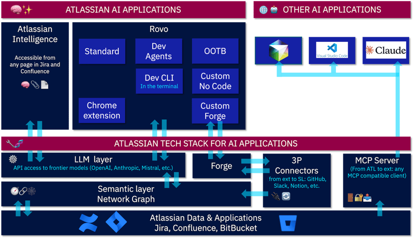

Atlassian 在 AI 时代的核心资产是 Teamwork Graph，一个始于 2019 年的项目，比 ChatGPT 早了 3 年。

这个图谱连接了企业内部所有系统中的对象和关系，如今包含约 1000 亿个对象和连接。

它不仅记录了谁访问了什么文档，还记录了两个事物链接到同一个 Figma 设计目的，五个事物为何链接到同一个客户记录。

**这些连接构成了组织的记忆和上下文，而这正是 AI 最需要的。**

> "Teamwork Graph 在 2019 年开始时只是一个技术探索。我们觉得'这很酷，以后肯定能用上'。如今它成为了百亿级的对象和连接，构成了公司知识的组织记忆。没人在 2019 年知道这会成为 AI 时代的关键资产。"

Atlassian 的软件天生充满了与其他系统的链接。

一个 Jira 工单会链接到 Salesforce 的客户记录、内部系统、需要构建的功能、Figma 设计、GitHub 代码库。

一个 Confluence 页面会引用各种文档和资源。

一个 Loom 视频必然是在讨论某件事情。

**这种混杂性让 Atlassian 拥有独特的知识图谱，知道企业内部各个系统如何相互关联**。

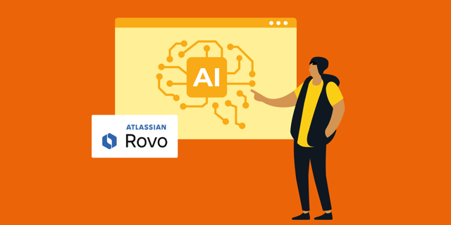

基于这个图谱，Atlassian 推出了 **Rovo**。

一个能够搜索和理解企业所有内容的 AI 助手。

Atlassian 的竞争优势还在于他们在**业务流程**中的位置。

每天有数百万个业务流程和工作流通过 Atlassian 运行：

审计团队移交给会计团队、会计团队移交给税务团队、销售流程、营销流程。

当企业要引入 AI 代理来提高这些流程的效率或准确性时，这种"工作流中枢"的地位让 Atlassian 成为 AI 代理协作的天然平台。

**Cannon-Brookes 相信价值来自"人机协作循环"**。

以 Jira 的 Work Breakdown 功能为例，用户可以要求 AI 将一个任务分解为多个子任务。

AI 会基于从 Teamwork Graph 中找到的相关文档给出建议：

"基于这些类型的文档，我认为应该分解成这些步骤，对吗？"

用户回应："这个不需要，这两个很好，你漏掉了这个文档。"

AI 再次尝试，用户继续反馈，最终达到"足够好"的 90%结果，用户自己补充剩余 10%。

**这种设计需要深入理解用户如何与 AI 协作，而不是简单地追求完全自动化**。

# 收购 Browser Company

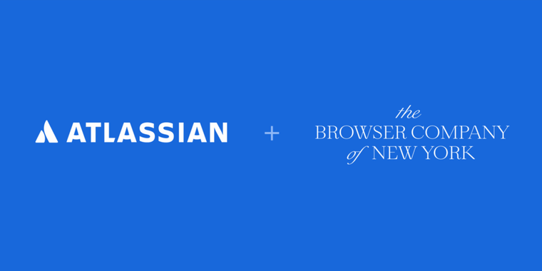

**2024 年底 Atlassian 收购 The Browser Company (Arc Dia 等 AI 浏览器的母公司）。**

一家以 Jira 和 Confluence 闻名的协作工具公司，为什么要收购一个浏览器创业公司？

The Browser Company 的首款产品 Arc 是"为知识工作者构建的浏览器"，它重新组织标签、任务和工作流，立即提高生产力。

AI 的到来让浏览器的重要性进一步提升。

现在我们在浏览器中有聊天、应用、搭建工作流，浏览器成为知识工作的中枢。

但 Cannon-Brookes 认为简单地"把 Chrome 和 ChatGPT 结合起来"不是答案。

> "我认为这需要大量的设计，而 The Browser Company 在设计方面非常出色。它需要改变人们使用日常应用的方式。"

从 Atlassian 的角度看，这个收购有多重战略意义。

第一，**他们的客户就是知识工作者**，改变这些人的日常工作方式正是 Atlassian 一直在做的事。

第二，浏览器本身基于 Chromium，渲染网页不是问题，问题是用户体验，是"**如何将我所有的 SaaS 应用、代理、聊天、标签、知识整合在一起，让我的一天更高效"。**

第三，浏览器拥有个人记忆（浏览历史），**但缺少组织记忆**，而 Teamwork Graph 恰好提供了这个。

**将两者结合，可以创造更高效的浏览体验。**

> "我们不是要为我的孩子做浏览器，不是为我的父母做浏览器，不是为购物或其他用途做浏览器。我们要为整天活在 Salesforce、Jira、Google Docs、Confluence、Figma、GitHub 中的人做浏览器。"

这个收购也体现了 Atlassian 对设计的重视。

Cannon-Brookes 认为**设计是构建优秀 AI 体验最困难的部分，因为这是"第一次真正意义上的基础设计"**。

用户不应该需要理解"确定性"和"概率性"的区别，但需要理解何时输出可能是错误的或创造性的。

设计的任务是向用户解释何时会发生这种情况，这需要极其细致的用户体验设计。

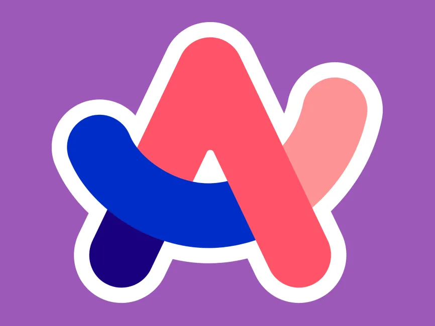

Cannon-Brookes 对 The Browser Company CEO Josh Miller 和团队的设计能力极为推崇。

Arc 已经证明了他们能够重新思考根深蒂固的用户界面范式。

现在的挑战是将这种设计能力与 Atlassian 的组织知识和 AI 能力结合起来，创造出一个真正为知识工作者优化的浏览器体验。

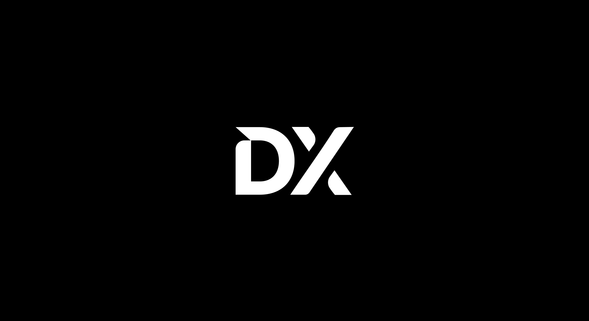

同时收购的还有 DX，**一家专注于衡量工程生产力的公司。**

这个收购与 AI 时代的成本管理直接相关。

Atlassian 内部使用 Rovo Dev、Claude Code、GitHub Copilot、Cursor 等多种 AI 编码工具，每个月的账单都在快速增长。

"DX 让我们可以衡量得到了什么回报。我应该支付两倍的费用吗？还是很多支出只是'很有趣'但实际上没有带来生产力提升？"

这将是一个困难的问题，**因为目前有大量资金投入到这些工具中，而准确衡量价值极其困难**。

# 七、F1 赞助的 GTM 创新

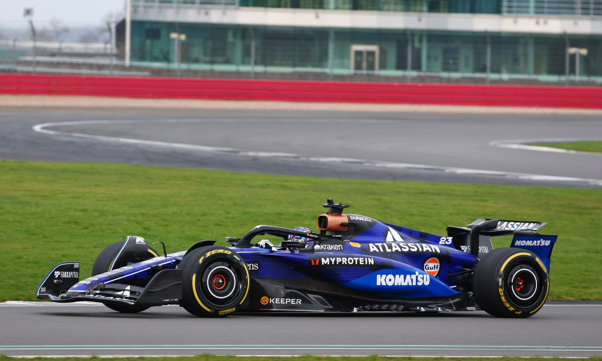

Atlassian 与威廉姆斯 F1 车队的合作是一个巧妙的 GTM 战略创新，将品牌营销、客户教育和销售机会整合到一个独特的体验中。

这个决策来自威廉姆斯车队领队 James Vowles 的主动接触，他本人是软件工程师出身，2004 年曾亲自下载并安装过 Jira。

他希望 Atlassian 帮助威廉姆斯提高团队协作效率，作为回报，他会给一个"角落里的小贴纸"——广告位。

但 Cannon-Brookes 看到了更大的机会。

F1 正在经历根本性转变：硬件变得不那么重要，软件变得更加重要。

> "威廉姆斯的软件开发人员数量是赛道上第二多的。"

由于成本帽限制，车队必须选择雇佣软件开发人员还是空气动力学家。

随着虚拟化和模拟技术的进步，**设计出完美的空气动力学曲线，不如让 1100 人高效协作**，而后者正是 Atlassian 的核心能力。

于是 Cannon-Brookes 问了一个问题："车顶的贴纸要多少钱？"

他们没有车顶贴纸，而这正是最显眼的位置。

经过计算，Cannon-Brookes 认为这是一个值得的"体育赌注"。

排名前三的车队获得的品牌曝光是后三名的 10 倍。

如果你要下体育赌注，就长期支持一支后三名的车队，帮助他们成为前三名车队，你的赌注回报会非常好。

> "我告诉 JV，我认为 2025 年我们会获得一次领奖台，2026 年会赢得一场比赛，到 2030 年会赢得总冠军——这是我的 OKR。"

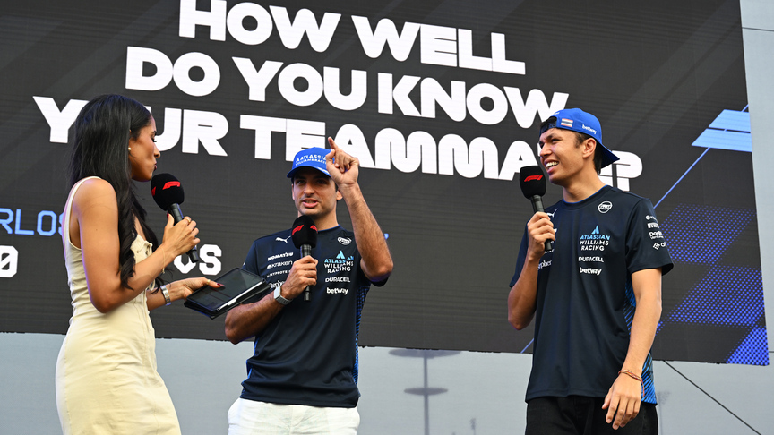

答案已经揭晓了。

**威廉姆斯 2025 赛季表现非常亮眼，是 2017 年以来最成功的一年！车队积分榜排名第五！（2024 年为第九）**

> "这超出了我们的预期，我希望它向全世界展示我们正在前进的方向……这是梦想成真的时刻。"

参与到这项全球赛事更深层的价值在于， F1 成为了"移动式执行简报中心"。

Atlassian 在全球有 200 多个国家的客户，无法亲自拜访所有大客户，更无法带客户去参观最优秀客户的工厂。

但 F1 每年在全球巡回比赛，几乎覆盖了 Atlassian 所有主要市场——墨尔本、新加坡、日本、英国、美国各地。

**每当 F1 来到一个城市，Atlassian 就可以邀请大量本地客户参加赛事，在车库中向他们展示威廉姆斯如何使用 Atlassian 产品。**

> "我可以告诉他们，当赛车的尾翼损坏时，系统如何通知这里，牛津工厂如何开始制造新的，如何运送到全球各地。
>
> 我可以展示资产管理和服务流程，展示我们如何帮助车库提高效率，如何帮助他们赢得比赛。"

**这是在激动人心的环境中、用真实客户案例进行的深度产品演示，比任何会议室演示都更有说服力。**

在蒙特利尔站，Cannon-Brookes 接待了大量加拿大客户。

有两家加拿大银行都是超过 20 年的老客户，现在每年支出 100 万到 200 万美元，而且还有增长到 1000 万的潜力。

> "我能够展示威廉姆斯如何使用系统的不同部分，这是非常直观和激动人心的客户案例。"

这种体验改变了客户对 Atlassian 的认知，从"工具"变成"帮助顶级组织赢得比赛的战略合作伙伴"。

这个策略也完美契合 Atlassian 的文化定位。

威廉姆斯是 F1 历史上最具传奇色彩的车队之一，但近年陷入困境。

**每个体育迷都喜欢复兴故事。**

这种"技术驱动的成功"正是 Atlassian 想要讲述的故事。

# 参考

**资料来源**：本文基于 Ben Thompson 和 Atlassian CEO Mike Cannon-Brookes 的访谈记录