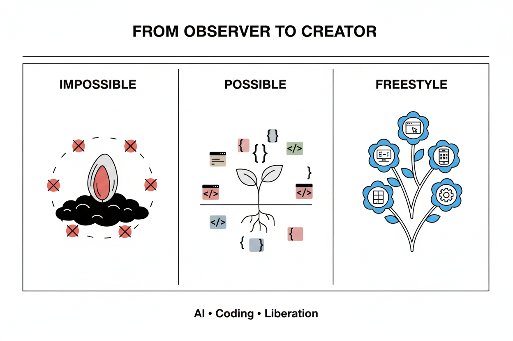

## 被“回避”的 AI Coding

其实回想起来蛮有意思的。

之前零零散散尝试过像 Cursor 这样的一些 AI coding 产品，但我一直没有真正深入去用过。

甚至，当我在社交媒体上看到有人分享说“我用 AI coding 开发了一个什么产品”时，我的第一反应往往是关注“你做了个什么东西”，然后下意识地去回避掉“他是用 AI coding 做的”这个事实。

为什么要回避？我觉得这源于一种身份认同的心理防御。我本身不是技术出身，过去的工作更多是做产品、做运营。

对于编程、网络、前端后端这些技术栈，我是零基础。

虽然因为工作需要，我会去理解产品架构，理解功能逻辑，但归根结底，我只知道“它是什么”，完全不知道“它该怎么被开发出来”。

这种陌生感让我觉得 AI coding 离我很远，或者说，**潜意识里我不相信自己能驾驭它。**

## 寻找缺失的“实感”：Builder Mindset

**最直接的动力，来自于一种强烈的“虚无感”。**

过去很长一段时间，我非常关注宏观趋势。

我读硅谷的博客，看华尔街的分析，听各种 Founder 的播客，看各种 VC 侃侃而谈 AI 市场的未来方向。

但在密集接触了海量信息后，我突然发现自己缺乏一种“实感”。

以前工作中，我会和产品经理紧密配合，打磨 MVP，跟客户验证，那个过程是很实在的。

但因为工作调整，这个“实体”的部分断层了。我变成了一个单纯的“趋势观察者”。

我意识到，必须从一个普通的 AI User，转变为一个 Builder。

我要找回那种从无到有创造事物的实感。

## 第一个觉醒时刻

在正式讲 AI coding 之前，我想先提一下 2025 年的一个突破：重拾公众号写作。

我深刻体会到了 AI 工具（比如 YouMind）带给我的改变。

> 我的邀请码：71O8I1 欢迎注册体验 <https://youmind.com/invite/71O8I1>

它让我意识到，写作可以是一件极其简单、纯粹的事情。

我有一个想法，然后我跟 AI 聊，让它帮我深入分析、理顺条理。

写作中遇到需要查证的资料、需要优化的表述，我都跟它交互；我想配图、想转音频，都能瞬间完成。

**这种体验让我进入了一种深度的“心流”模式。**

专注于那个核心观点的表达，而不用被琐事打断。

我确信了一个观点：**AI 时代产品的核心精神，就是让用户能够“随心所欲”地创作。**

写作对我来说本是基操，AI 只是提升了效率、加深了思考的纵深、拓宽了题材的广度。

但这只是序章，真正的震撼来自于接下来的 Coding 体验。

## 第二个觉醒时刻：AI Coding 带来的震撼

在过去的几天里，我做了两件事：

1. **上线了我的个人博客（[Kangyuan.me](http://Kangyuan.me))**：从 0 到 1，网页界面设计、部署、交互细节，全是我跟 AI 共同完成的。

2. **开发了一个本地日程管理应用**：这是我用来练手的项目。

在这个过程中，我购买了自己的域名，把网页部署到了服务器上，开始使用 GitHub——这个以前跟我生活毫无关系的东西，我学会了怎么同步代码、管理分支。

这一切都是通过与 Google Antigravity 对话完成的。

我告诉它我的想法，它去执行；

我测试发现问题，反馈给它，它去修正。

甚至对于性能优化、前后端交互这种我完全不懂的领域，它也能帮我搞定。

**这种“随心所欲”的感觉，比写作时更加强烈。**

因为对于 Coding，我原本是完全无能为力的。

没有 AI，我想做一个个人网站，得去找开源组件，还得研究怎么部署，看教程都看不懂。

**那种挫败感会直接劝退你。**

但现在，我直接拥有了一个比我懂得多得多的“Coding 伙伴”。

冷静、客观、执行力强。

看着代码一行行生成，产品从无到有地跑起来，那种感觉真的太神奇了。

它可以延展到 Everything——我可以让它写爬虫，做自动化，开发浏览器插件，做任何我想做的事情。

## Builder Mindset：与 AI 共生的五个阶段

“Builder Mindset”（建设者心态）是一个成长路径。我认为每个人在使用 AI 时，都会经历这五个阶段：

1. **黑盒用户阶段 (The User)**：\
   这是 95% 人的状态。你用豆包、ChatGPT，只是简单地问答。用户将 AI 视为搜索引擎或问答系统，它仍是一个黑盒，未集成到工作流程中。

2. **实习生导师阶段 (The Supervisor)**：\
   你开始分配离散任务：“生成这个计划”、“总结这份文档”。AI 作为实习生——执行具体指令，但需要人类监督和最终交付。

3. **队友协作阶段 (The Teammate)**：\
   关系变得真正协作。AI 独立处理完整的工作流程片段（例如，产出设计草稿、编写初始代码实现）。用户提供高层指导和迭代反馈。这代表真正的生产力倍增。

4. **系统架构师阶段 (The Manager)**：\
   用户作为架构师运作，在多个 AI 代理或专业工具之间分配任务。重点从任务执行转向工作流设计和质量保证。这需要对 AI 能力和局限性的深入理解。

5. **合作伙伴阶段 (The Partner)**：\
   AI 成为构思和创造的真正合作者，而非仅仅执行者。这一阶段在很大程度上仍是理论性的，但代表了长期轨迹——AI 作为思想伙伴，而非仅仅是生产力工具。

## 原子化社会的创造力爆发

现代社会趋向原子化的特征就是，个人作为独立经济单元运作，而非在传统制度结构内（家庭、企业、地理社区）。

这通常被负面定义为：孤立、社会资本流失、集体行动减少。

但我有一个大胆的猜想：**思想的原子化，并不代表思想的结束，反而可能带来思想深度与创造的爆发。**

当社会原子化，个人的思想会变得更加独特且具象。

当个体创造者可以直接将想法转化为作品（产品）而无需制度中介时，我们看到：

1. **创意多样性增加**：个体视角，不受组织约束，创造出更加多元化、更具个性的作品

2. **协调成本降低**：无需协调团队、获取资金或处理组织政治来测试想法

3. **迭代周期加快**：个体创造者可基于反馈即时调整，无制度摩擦

4. **新价值捕获模式**：个人可以为小众群体开发产品，这些市场用户占比很小，传统软件公司无法覆盖成本

**而 AI Coding 这样的工具，恰恰赋予了每一个“原子”将自己独特的思想转化为实体的能力。**

以前，你有一个奇思妙想，因为没有技术能力，它只能停留在脑海里，或者变成一段文字。

但现在，你可以把它做成一个产品、一个工具、一个艺术品。

**当无数个原子化的思想，都能通过低成本的工具转化为实体作品时，我们可能会迎来一种惊人的、空前的社会想象力爆发。**

这会改变一切，工作流、教育、管理乃至整个社会关系。

## 结语：随心所欲的创造

回过头来，2025 年对我来说，最重要的感悟就是这两个时刻：

YouMind 带来的写作自由，和 AI Coding 带来的创造自由。

AI 时代产品最核心的价值，无论是对个人还是对社会，就是**让用户可以随心所欲地创造属于他们自己的作品。**

这种感觉现在描述起来可能还有点模糊，但它又是如此具体。

而约束已经从技术能力转移到**思维和问题定义**。