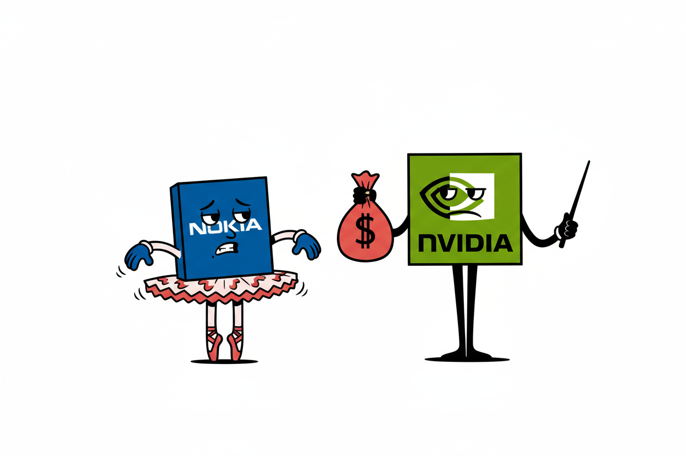
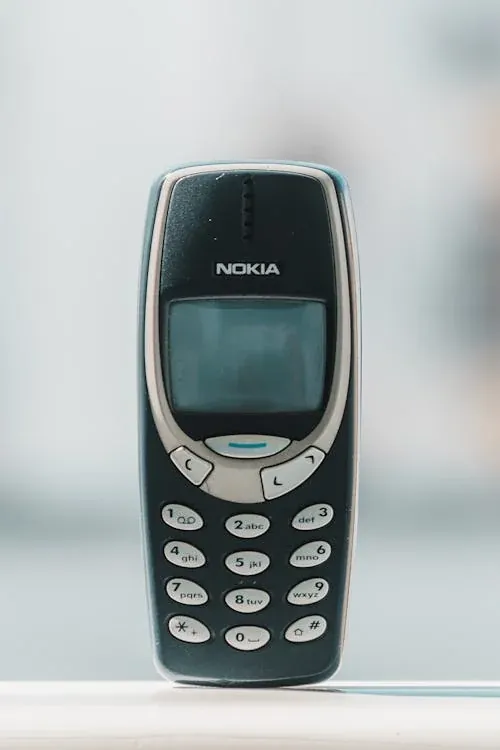
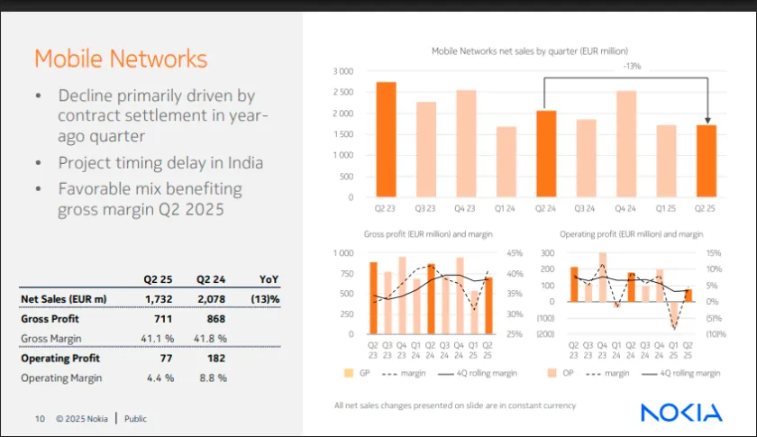
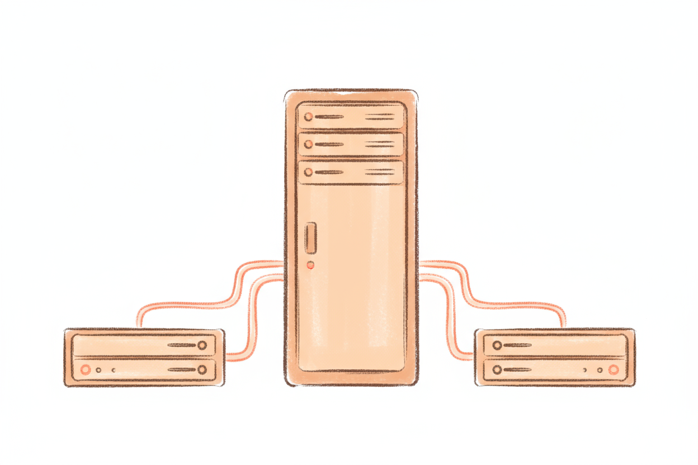
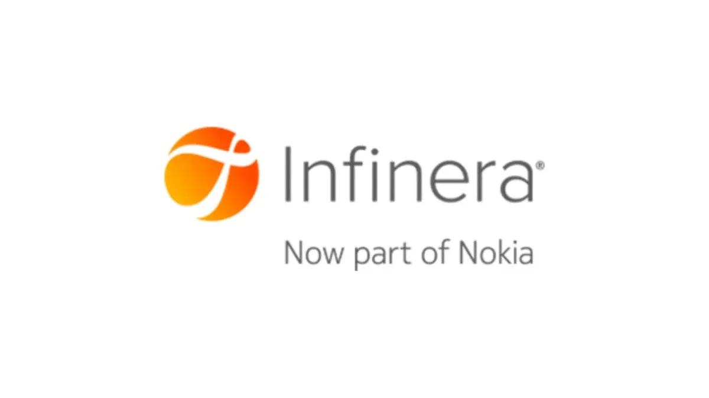
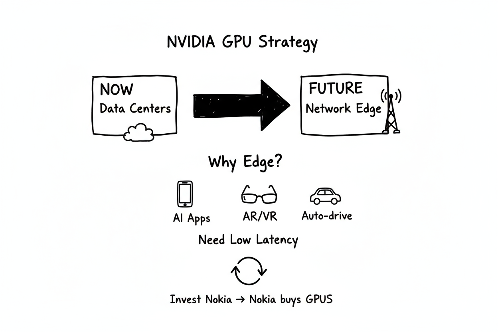
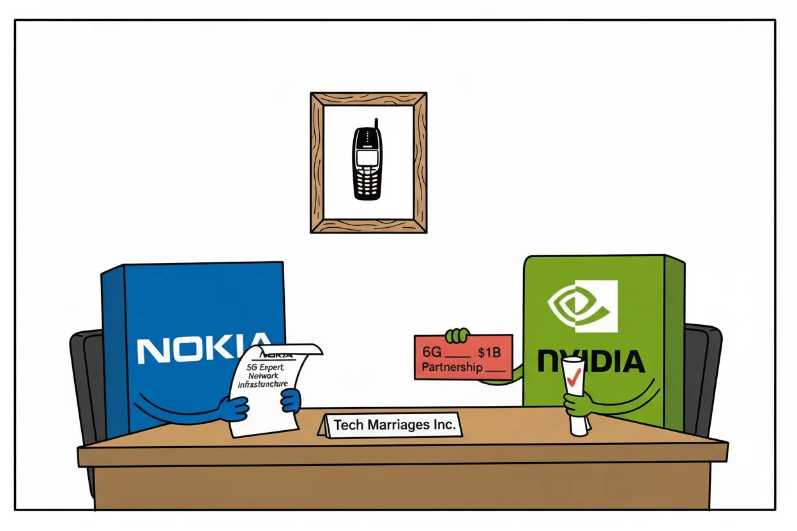
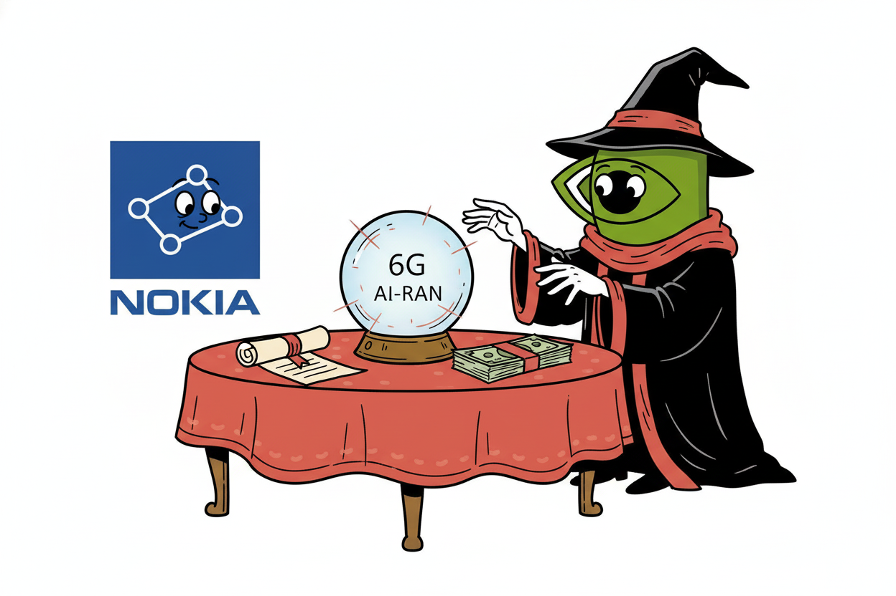

2025年10月28日，全球AI芯片巨头英伟达（NVIDIA）宣布向芬兰电信设备制造商诺基亚（Nokia）投资10亿美元，获得后者约2.9%的股份，成为Nokia的第二大股东。

这一消息公布后，Nokia股价当日飙升超20%，创下近十年来的最高点。

# 为什么是诺基亚？

对于许多人来说，Nokia唤起的是关于手机的记忆。

在智能手机时代到来之前，Nokia曾是全球手机市场的霸主，市场份额一度超过40%。然而，2007年iPhone的横空出世彻底改变了游戏规则。

Nokia在智能手机转型中反应迟缓，固守塞班系统，最终在市场竞争中节节败退。

2013年，Nokia将手机业务以54.4亿欧元（约72亿美元）的价格出售给微软（Microsoft）。

但这场"联姻"最终也以失败告终。Microsoft在2015年对这笔收购减值，并在2016年将剩余的功能机业务转售。

我们在范式转移的文章里曾经简单讨论过这场失败。

曾经的手机巨头似乎就此消失在公众视野中。

但这就是Nokia的全部故事吗？

**<u>显然不是。</u>**

## 从手机到网络基础设施

事实上，在退出手机业务后，Nokia并没有消失。公司将重心转向了电信基础设施领域，成为全球最大的网络设备供应商之一，与爱立信（Ericsson）、华为（Huawei）并列为行业三巨头。

但仅仅做一家传统的电信设备供应商并不没有给Nokia带来巨大的增长，特别是在2024年，在北美市场失去了AT&T的大单（被Ericsson抢走），移动网络业务的收入也在持续走低。

**好在大象没有放弃舞蹈。**

近年来，Nokia积极向新技术领域拓展，特别是在AI、边缘计算、云服务和数据中心基础设施方面进行了大量布局，这也是NVIDIA投资的重要原因。

## 聚焦AI和数据中心

2025年4月，Nokia任命了一位关键人物——贾斯汀·霍塔德（Justin Hotard）担任新任CEO。这位美国高管此前曾领导英特尔（Intel）的数据中心和AI业务，在惠普企业（HPE）也有高性能计算和AI方面的丰富经验。

Justin Hotard的到来标志着Nokia战略方向的明确转变。他将当前的AI浪潮称为"AI超级周期"，并将其与1990年代的互联网热潮相提并论。

在他的领导下，Nokia创建了专门的技术与AI部门，由首席技术官Pallavi Mahajan（同样来自Intel AI团队）领导，全力推动AI在Nokia产品线中的应用。

Justin Hotard的愿景很清晰：

**Nokia要成为AI时代基础设施的关键参与者，而不仅仅是传统的电信设备供应商。**

### 三大战略奠定转型基础

**1. 进军数据中心网络市场**

早在2020年，Nokia就开始瞄准数据中心市场，推出用于自动化数据中心运营的网络硬件。

传统上，Nokia的主要客户是电信运营商（如中国移动（China Mobile）、AT&T等），为他们提供基站、核心网等设备。但这个市场增长缓慢，竞争激烈，利润率不断下降。

与此同时，一个新的巨大市场正在崛起：**数据中心网络**。

随着云计算、视频流媒体、社交媒体的爆发式增长，Google、Amazon、Microsoft、Meta等科技巨头建设了数以千计的大型数据中心。这些数据中心内部需要大量的网络设备——高速交换机、路由器、光纤传输系统——来连接成千上万台服务器。

更重要的是，**AI训练和推理需要海量的数据传输。一个大型AI模型训练时，数千块GPU之间需要高速通信，对网络设备的性能同样要求极高——这是一个价值数百亿美元的新市场。**

Nokia意识到自己在电信领域的技术积累（高性能路由器、光传输系统）完全可以应用到数据中心场景，于是开始：

- 开发专门针对数据中心的高容量交换机和路由器

- 推出数据中心之间的高速光互联解决方案（数据中心往往分布在不同地理位置，需要高速连接）

- 提供网络自动化软件，帮助数据中心运营商更高效地管理复杂的网络

**2. 收购Infinera：打开超大客户之门**

2025年3月，Nokia完成了一笔关键收购：**以23亿美元收购美国光学网络设备制造商Infinera**。

Infinera带来的不仅是尖端的光互联技术，更重要的是与美国科技巨头建立的牢固关系。

Infinera超过50%的收入来自超大规模（hyperscale）客户——也就是Google、Microsoft、Amazon这样的云计算巨头。

这次收购<u>大幅扩大了Nokia在数据中心互联市场的存在，并加强了其在北美的影响力</u>。

**3. 边缘计算和专用网络布局**

Nokia还积极布局边缘计算和企业服务领域，为工业和园区环境提供专用4G/5G网络。

2024年初，Nokia与戴尔科技（Dell Technologies）加强了合作伙伴关系：Nokia成为Dell Technologies在企业边缘用例中首选的专用无线网络提供商，而Dell Technologies则为Nokia提供边缘计算基础设施。

这些举措强调了Nokia的战略定位：

**成为边缘计算与AI和物联网结合的关键参与者，在传统电信运营商之外的新市场中发挥作用。**

Nokia的转型已经开始显现成效。

2025年第三季度，公司业绩超出预期，得益于"对光学和云技术的强劲需求"。Nokia称这一AI驱动的转变是"自2013年出售手机业务以来Nokia最重要的战略步骤"。

> "我们在第三季度取得了稳健的业绩表现，净销售额增长9%，所有业务部门均实现增长。网络基础设施业务净销售额增长11%。光学网络业务增长19%，主要来自AI和云客户的需求。"——Justin Hotard（Q3 2025）

Nokia重新进入了NVIDIA的视野。

# 英伟达的"算盘"

## 开辟AI芯片的新市场

**将AI推向网络边缘**

迄今为止，NVIDIA极其成功的AI芯片（GPU）主要销售给大型数据中心，用于云和企业AI工作负载。

但NVIDIA CEO黄仁勋看到了一个更大的机会：

**将AI计算能力扩展到电信网络的边缘——进入全球各地的基站、蜂窝塔枢纽和网络数据中心。**

这一机会的假设是：

<u>智能手机上的AI助手、AR眼镜、自动驾驶、智能无人机——这些下一代应用都需要强大的AI计算能力，而且必须部署在离最终用户更近的地方，以避免延迟。</u>

全球电信运营商共同拥有**数百万个分布式站点**。**如果这些站点都能部署NVIDIA的GPU，这将是一个巨大的新市场**。

通过与Nokia合作，NVIDIA为其处理器在网络边缘开辟了一个全新的市场（**Total Addressable Market**）。

**NVIDIA多次通过投资来创造对自己产品的创造未来需求**

Nokia投资遵循同样的逻辑：

NVIDIA帮助资助Nokia开发GPU驱动的网络解决方案，反过来Nokia及其电信客户将购买NVIDIA的AI硬件，旨在锁定NVIDIA技术作为未来电信系统的基础。

## AI-RAN的技术革命

**什么是AI-RAN？**

AI-RAN（AI无线接入网络），简单来说，就是把AI"装进"手机信号基站里。传统基站只负责发射和接收信号，而AI-RAN基站不仅能做这些，还能像"聪明的大脑"一样优化网络性能，同时提供边缘AI推理服务。

**核心技术平台**

NVIDIA和Nokia打造的平台有两大创新：

1. **统一的软件基础设施**：将网络通信和AI计算整合在同一个平台上。这就像把"信号塔"和"计算中心"合二为一，既能优化频谱使用，又能节省能源。更巧妙的是，当基站不忙的时候，还能把闲置的计算资源出租给需要AI服务的企业，创造额外收入。

2. **边缘AI服务**：把AI计算能力部署在离用户更近的地方（基站），提升响应速度更快，数据也更安全。

**关键产品：ARC-Pro平台**

NVIDIA推出了专门为6G时代设计的ARC-Pro平台（Aerial RAN Computer Pro）。

这是一个集成了连接、计算和传感三大能力的"超级计算盒子"。

最大优势是"软件升级"——就像系统更新一样，升级到6G不需要更换硬件。这大大降低了运营商的升级成本。

Nokia将把这一平台嵌入其RAN产品线，特别是其模块化的AirScale基带架构。

# 双赢 Win-Win

## 从诺基亚的角度看：

**1. 资金与技术的双重加持**

**NVIDIA实际上在为Nokia的转型"买单"**。

将传统的5G/6G基站软件改造成能在NVIDIA GPU上运行，需要大量工程开发和优化工作——这既有技术风险，也有成本压力。

现在NVIDIA通过投资分担了这部分代价，大大降低了Nokia转型的财务风险。

这种"资金+技术绑定"的模式，让Nokia可以放心大胆地推进AI-RAN产品线，因为即便短期内市场不成熟，至少研发成本已经有人分担。

**2. 美国市场的"敲门砖"**

Nokia作为欧洲企业，在美国市场一直处境尴尬。目前美国三大运营商中，只有T-Mobile还保持与Nokia的合作关系。

作为美国本土的科技巨头，NVIDIA的技术加持和政治背书对美国运营商更具吸引力。

**一个搭载NVIDIA AI技术的Nokia解决方案**，在"美国优先"的产业环境下，显然比纯欧洲方案更容易获得认可。

**3. 差异化竞争优势**

在与Ericsson的竞争中，Nokia一直处于下风。而现在，与NVIDIA的深度合作成为了一个高调的差异化因素。

Ericsson选择了与Intel合作开发定制芯片，走的是传统路线。而Nokia+NVIDIA的组合，代表着新方向——这给了Nokia一个弯道超车的机会。

## 从英伟达的角度看：

**1. 撬动电信市场的"支点"**

对NVIDIA来说，10亿美元只是"零花钱"，但却买到了进入电信行业的入场券。

电信RAN市场虽然目前规模有限（2024年全球约350亿美元），但6G周期临近，AI驱动的网络升级蕴含巨大潜力。

如果全球数百万个基站都部署NVIDIA的GPU，这将是一个全新的增长引擎（我们前面讨论过）。

**2. 从云到边缘的生态闭环**

通过与Nokia合作，NVIDIA正在构建一个覆盖"云-管-端"的完整AI生态：

- **云端**：NVIDIA GPU提供训练和推理算力（数据中心）

- **管道**：Nokia高性能光互联设备承载数据传输（收购Infinera后的优势）

- **边缘**：双方共同开发的AI-RAN基站部署分布式算力节点

这不仅扩大了NVIDIA芯片的应用场景，更重要的是让NVIDIA掌握了未来计算架构演进的主动权——无论计算重心是在云端还是边缘，<u>NVIDIA都在场</u>。

**3. 6G标准的话语权**

作为Nokia的第二大股东（持股2.9%），NVIDIA获得了影响Nokia产品路线图和战略决策的能力。

这意味着在6G标准制定过程中，NVIDIA可以通过Nokia推动"AI原生架构"成为行业共识，将自身的CUDA软硬件栈延伸为未来网络的基础设施标准。

黄仁勋在GTC上反复强调"电信领导地位"——NVIDIA+Nokia的组合，正在争夺下一代通信技术的主导权。

## 1+1>2

**双方的战略方向是高度一致的**。

Nokia要从传统设备商转型为"AI时代基础设施提供商"，NVIDIA要从数据中心芯片商扩张为"无处不在的AI算力提供商"。

"Nokia需要资金，NVIDIA需要范例，双方一拍即合。"

**未来几年将是关键的观察期。**

> "电信领域的下一次飞跃不仅仅是从5G到6G，而是对网络的重新设计，以提供AI驱动的连接，能够从数据中心一直到边缘处理智能。我们与NVIDIA的合作，以及他们对Nokia的投资，将加速AI-RAN创新，**将AI数据中心放入每个人的口袋**。"
>
> ——Justin Hotard

这个愿景能否实现？让我们拭目以待。