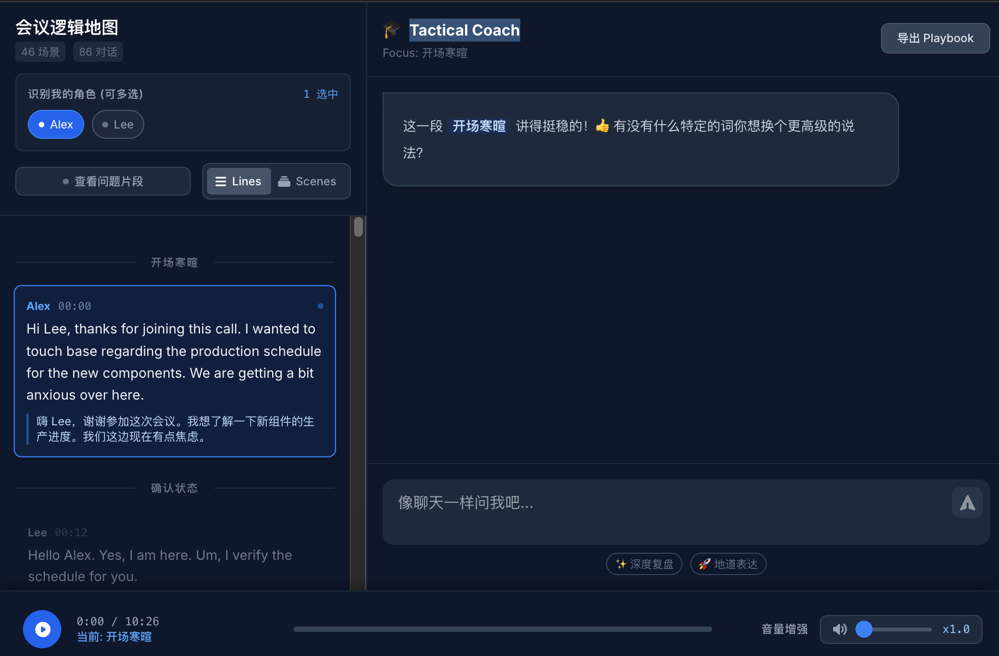
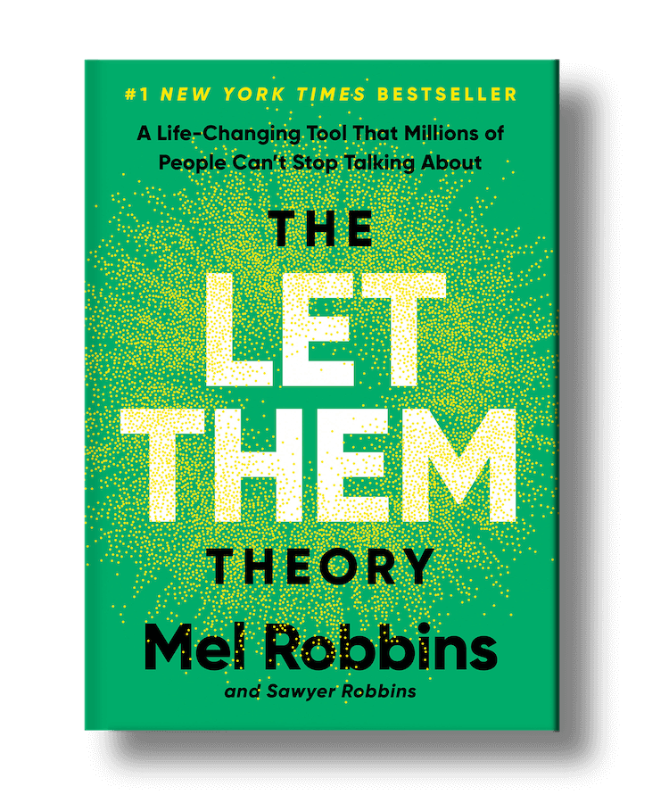
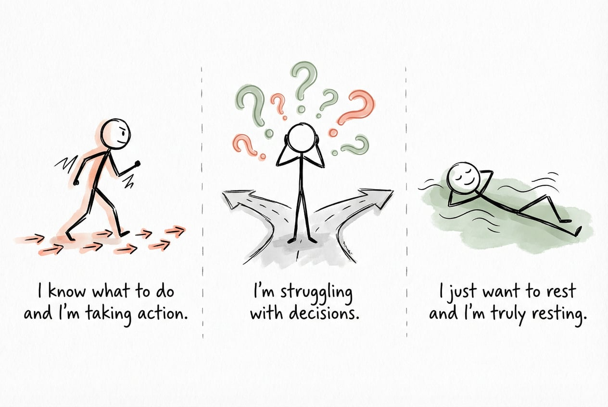
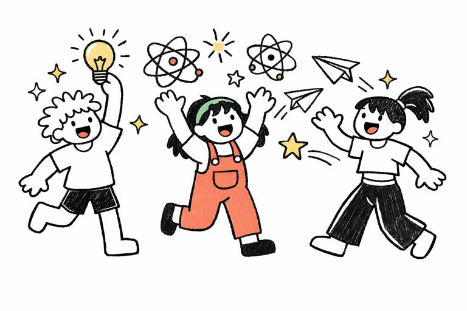

> *致 Kangyuan.C —— 一位在 AI 浪潮中寻找自我定位的产品思考者*

今年最大的感受是时间过得好快。嗖的一下，2025 年就结束了。

2025 年

职业上，我经历了第一次离职

生活上，我从无锡回到了家乡广州，结束了北京-阿姆斯特丹，无锡-深圳的异地

个人兴趣上，我重新开始写公众号、在即刻上认识了很多志趣相投小伙伴、做了自己的博客网站……

副业上，没啥副业哈哈，给一些初创产品当义工，拿过飞书一两次商单 hhh

25 年年初，我说，我想做点不一样，关注“人”，注重“事”，要“表达”。

我做到了🎉

我关注站在探索前沿的人，与他们交流，学习，碰撞。

我注重自己在做的事，什么想做，什么不想做，做事的姿势是什么。

我开始表达，拿起笔，记录思考、和自己大脑左右互搏。

# 关于产品的思考

是的，还是先讲产品。

## 一切都应该「有趣」

**需求演变：从「它能做什么」到「它让我感受到什么」**

年初，我关注的是<u>功能</u>

年中，我开始关注<u>体验</u>

年末，我的关注点转向<u>价值</u>

功能只是表层，体验是中层，价值才是内核。

真正伟大的产品，不是功能最强的，而是让用户在使用过程中，感受到一种快感（快乐）、自我实现的满足。

**「好玩」是最高评价**

9 月的时候，我发了个 post

在功能和定位同质化的时代，**让用户「玩得开心」比「用得高效」更重要**。因为效率可以量化、可以比较，但快乐是主观的、独特的、不可替代的。

## 一次性产品与原子化创造

12 月我做了三个一次性工具。

1、好朋友的日语练习器原型

2、爬取 Instagram 图片

3、爬取即刻平台发言

4、校验项目文档更改细则

它们都是一次性的小工具，在完成任务后，再也没有打开过，**用完即弃**。

**当然也有一些持续在开发的**。

1、我的个人博客：[kangyuan.me](http://kangyuan.me)

2、日程管理 app: Daily Yorker

3、英语会议教练：Tactical Coach

说是持续开发，其实也是个人需求，并没有过多考虑商业化相关的事情。

### **AI native 意味着利用 AI 以更高效的方式达成结果，不是执着 AI 本身。**

> 长期以来，代码一直是被看作是需要精心维护的资产。因为昂贵，所以我们强调复用性，强调不要重复造轮子。但在 AI 时代，AI 对代码带来的最大变量，并不是帮我们更快地写完最终产品，而是将制造工具这件事的边际成本降到了几乎为零。——yage

当制造工具的边际成本几乎为零，很多过去的共识就变得“无意义”。

比如代码要注重可复用性、围绕开发成本设计的流程、产品&开发&运营三者之间的组织关系、对于定制化的判断……

我们避免重复造轮子，强调复用性，建立标准化流程，本质上都是在与高昂的成本做妥协。

但当 AI 将制造工具的成本降至接近零，那些曾经被视为“不专业”“不可持续”的做法——用完即弃的工具、针对单一场景的定制、跳过繁琐流程直接动手，反而成为了更高效、更灵活的选择。

yage 在其博客中举了一个更生动的例子：

> 在机器学习研发中，我需要检查标注团队重新标注的数据质量——具体改了什么，有没有改对。
>
> **传统做法有两种**：
>
> 第一种，写代码做可视化工具。需要一两个小时，但我只是想做一个十分钟的检查，成本不划算。
>
> 第二种，人工抽样比对。十分钟搞定，但只能看到局部，决策质量很低，更依赖运气和经验。
>
> **但用 AI，我选择了第三种**：直接把 JSON 文件和图片链接丢给 AI，让它生成一个可视化网站。两分钟后，我得到了一个包含完整对比、过滤、排序功能的工具。不需要抽样，不需要猜测，直接看到所有改动的分布。十分钟内，我完成了全量检查，做出了精准的决策。

那么，所谓 AI native 产品/公司/人，代表的是一种新的策略选择。

面向结果，透明过程。

**所有的策略都是直接服务于结果的，快速验证并达成正确的结果。**

**所有的执行都是透明的，过程不再是额外的负担，而是天然的资产。**

这是飞书之前提倡的“信息文档化”文化：

> **飞书提倡"信息文档化"**，凡会议、周报，都通过文档的形式记录下来。只有当劳动成果以信息、知识的形式被记录下来，才有可能沉淀为有用的**数字资产**，才有可能为更多的人传递价值。

这些数字资产，以前是给人看的，可又有多少人能真的看完、看懂，理解项目的每一次变化呢？

但，AI 可以。

### 原子化创造

具体的大家可以看看我的这篇文章：<https://mp.weixin.qq.com/s/SFuW2qIsDI1WVAT4MvwrWA>

> 现代社会趋向原子化的特征就是，个人作为独立经济单元运作，而非在传统制度结构内（家庭、企业、地理社区）。 这通常被负面定义为：孤立、社会资本流失、集体行动减少。 
>
> 但我有一个大胆的猜想：思想的原子化，并不代表思想的结束，反而可能带来思想深度与创造的爆发。 
>
> 当社会原子化，个人的思想会变得更加独特且具象。 
>
> ......
>
> 以前，你有一个奇思妙想，因为没有技术能力，它只能停留在脑海里，或者变成一段文字。 
>
> 但现在，你可以把它做成一个产品、一个工具、一个艺术品。 
>
> 当无数个原子化的思想，都能通过低成本的工具转化为实体作品时，我们可能会迎来一种惊人的、空前的社会想象力爆发。 
>
> 这会改变一切，工作流、教育、管理乃至整个社会关系。

# 关于生活与成长

**“兴趣，是第一生产力”**

这一年，我陷入了两个焦虑：

### **第一个是一直在反复纠结“我想做什么”这件事。**

这个问题，我其实选择了逃避。

大学打各种比赛，然后毕业、实习、工作、换工作...

看起来我在围绕一个主线推进人生，外人看来，这个主线还很清晰。

NO！

事实上，它巨无霸模糊。

下半年，我开始调整自己的思路，我尝试多问自己两个问题：

**1、我不想做什么？**

**2、忽略所有因素，如果要投入做一件事5 年，那是什么？**

这两个问题可以帮助我重新审视当前的现状，以及为思考未来提供一个切入点。

如果你也在经历类似的状态，不妨也问问这两个问题。

希望下次我能来分享我的答案😄

### **第二个焦虑是企图让所有人满意。**

在生活/工作中，我一直想让让所有人都满意。

但，这是不可能的！

《Let them》这本书里提到：

> - **这是一个不可能完成的任务**：试图取悦所有人会浪费大量精力去管理他人的行为和情绪，最终会耗尽你的能量和自我
>
> - **People-pleasing 的本质**：这是一种想要完美控制他人脑海中想法的完美主义形式，让你永远无法放松或感到安全
>
> - **根源问题**：取悦他人者往往把自尊完全建立在为他人做了多少事、取悦他人的成功程度上，这成为一种对他人认可的"上瘾"

书中提到了两个方法去应对这种状态：

- **Let Them！**

如果你的朋友周末没邀请你去早午餐，let them（让他们去吧）

人们会通过他们的行为向你展示他们的真实面目，你需要让他们这样做——真正的权力在于**你选择如何应对！**

- **Let Me！**

这是 "Let Them" 的另一面，也是真正力量所在：

**"Let Me"** 是指为自己的下一步行动负责，为创造你想要的生活、关系和联系负责

没有这一步，你会发现自己与他人疏离，而不是被赋能。

我非常推荐这本书！

我开始基于这本书中的方法开始实践，虽然真的很难，你会发现生活/工作中的各种影响因素太多了，但我已经能感觉到我的思考方式正在发生变化。

### **另一个更重要的是，“行动（take action）”**

人一共有三种状态：

- “我知道我要做什么，我在行动”

- “我很纠结”

- “我只想躺平，我真的躺平了”

一头一尾的人，是幸福的，因为他们都是知行合一的人，特别好。

最糟糕的是中间这部分，我也在其中，永远在纠结、犹豫，一切都处在一种“不确定”的状态。

当回望时，你会发现，自己消耗大量的时间和精力，却没有获得一点反馈。

为什么？

因为没行动。

我们总是会被奇奇怪怪 ego（自我）阻碍实际的行动。

比如我在这篇文章<https://mp.weixin.qq.com/s/SFuW2qIsDI1WVAT4MvwrWA>中提到的：

> 为什么要回避？我觉得这源于一种身份认同的心理防御。
>
> 我本身不是技术出身，过去的工作更多是做产品、做运营。
>
> 对于编程、网络、前端后端这些技术栈，我是零基础。
>
> .......
>
> 这种陌生感让我觉得 AI coding 离我很远，或者说，**潜意识里我不相信自己能驾驭它。**

但当我行动后，这些想法真的很“蠢”

除了浪费时间，一无是处。

take action！动起来，别管那么多，先行动起来！

# 结语

想说的太多了，咱以后慢慢聊。

我就用 AI 给我的 2026 新年寄语，作为结尾：

> 2026年，愿你继续在探索中创造，在创造中快乐。 
>
> 愿你永远保持"have fun, enjoy it"的心态。 
>
> 愿你成为那个"不需要/不得不/不得已/不畏惧/不排除"的自己。 
>
> 愿你的思想，像那些原子化的个体一样，迸发出惊人的能量。

共勉！

新年快乐！

Take care and be well！