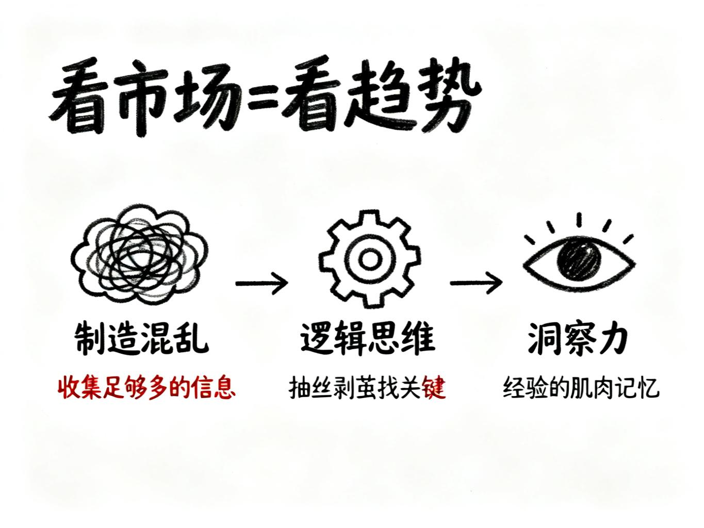
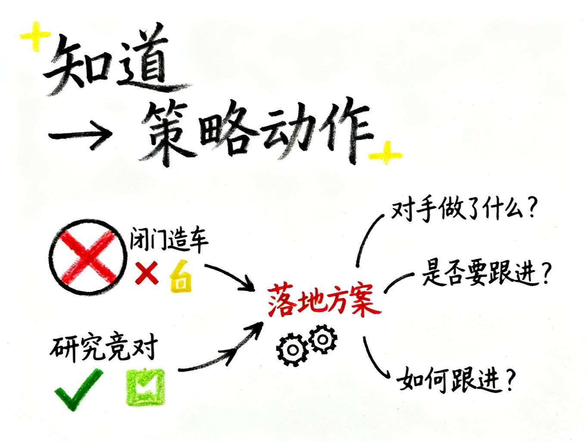
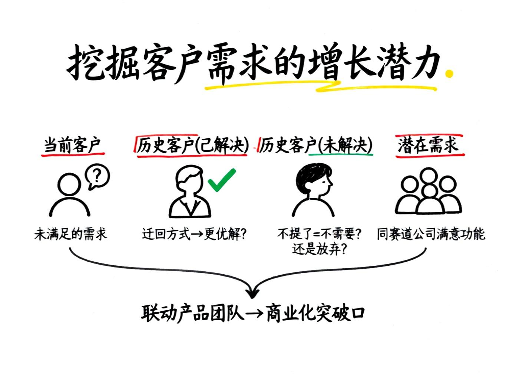
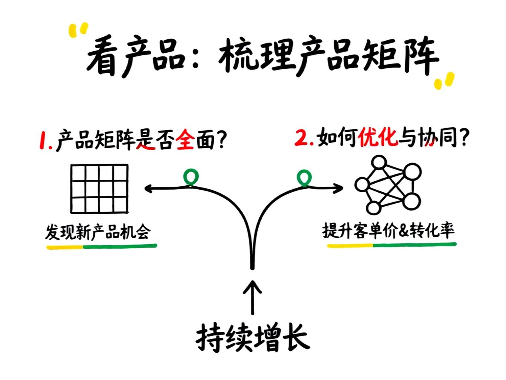
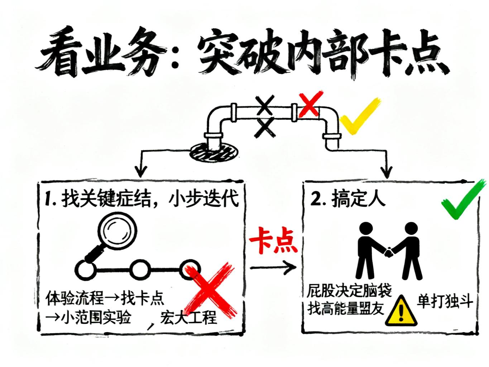

说回老本行，聊聊商业化增长。

虽然是从增长运营的视角展开，但其实也适用于很多岗位和角色，一起交流交流。

做商业化增长这几年，我发现这活儿最大的痛苦是方法太多、信息太杂，根本不知道从哪儿下手。

更要命的是，随着市场竞争越来越激烈，从上到下都死盯着增长结果，压力大不说，还特别容易让人在思考和执行上走偏。

基于这些年的摸爬滚打，以及前辈的指点，我整理了一个"五看方法论"框架，把日常工作里那些真正有用的观察角度梳理出来。

如果你后面要做增长策略，不妨从这5个维度展开。

# 1. 看市场：洞察内外部行业趋势

**看市场，本质是看趋势。**

这要求我们具备战略眼光，能够在宏观环境的变化中把握和发现方向。

对趋势的把控，往往始于一堆混乱的信息和数据。

要看懂趋势，我认为需要三种核心能力：

**制造混乱的能力**：这听起来有些反直觉，但其实就是尽可能多地获取信息。

当你觉得无法洞察方向时，通常是因为信息还不够“混乱”，不够多。

你需要主动去发散，收集内部和外部的各种信息。

**内部的**，比如业务流程、历史决策、数据流转；

**外部的**，比如行业玩家、竞对动态、上下游变化等。

先让一切混乱起来，有充足的信息，才能有看清趋势的底子。

**严谨的逻辑思维**：这是在混乱中抽丝剥茧、找到关键点的能力。

如何拆分、归类、理清问题，都需要强大的逻辑作为支撑。否则，信息越混乱，你就越无从下手。

**敏锐的洞察力**：这或许带有一些天赋，但更多是大量业务实践炼就的一种本能，像是“一把利刃划开浓雾”。

在整理完混乱的信息后，你需要洞察其本质。

有人称之为第一性原理，我认为它更像一种基于过往经验的“肌肉记忆”，能让你在信息中快速定位核心问题与机会。

看清楚如今内部环境与外部市场的发展趋势是什么。

比如在[Unity转型案例](https://craft.boxmrchen.com/019a81de-b7c4-795f-b8c4-798c6c82c576)中，Bromberg接手Unity这个烂摊子后，第一步就是大量收集游戏引擎行业的发展趋势、竞对动态（如Unreal Engine）、开发者反馈等“混乱”信息，通过识别出核心问题，制定正确的转型策略，最终实现扭亏为盈。

# 2. 看竞对：借鉴成功方法

知己知彼，百战不殆。

看竞对，核心是学习和借鉴他们已经验证过的有效方法。——**聪明地“抄”**。

举个例子，在增长工作中，定价策略至关重要。

虽然定价方法有很多，但参考对手的定价往往是最直接有效的方式之一，特别是如果你是后来者或者行业老二。

竞对的定价有可能也是乱拍的，但大概率经过一段时间的市场验证。

在竞对的定价框架下，看自家产品的定价如何设计，成本如何优化，从而找到差异化竞争的空间。

具体来说，竞对的定价可以作为一个“锚点”。

比如竞对的标准版是100元/月，旗舰版是300元/月，那这个价格区间就告诉你：

市场能接受的大致范围在哪里。你的定价如果远低于100元，用户可能会怀疑产品质量；

如果远高于300元，就需要提供明显更强的价值支撑。

有了这个锚点，你可以做两件事：

**第一，倒推成本优化空间。** 如果竞对100元/月能盈利，而你的成本是120元/月，那问题就很明显了——要么优化成本结构，要么重新思考商业模式是否可持续。

反过来，如果你的成本只有60元/月，那就有更大的定价灵活性，可以选择价格战，也可以选择保持竞对价格但提升利润率。

**第二，寻找差异化切入点。** 不一定要在同样的价格带正面硬刚。你可以通过功能组合、服务模式来错位竞争。

比如竞对是按功能模块收费，你可以尝试按使用量收费；竞对是年付制，你可以提供更灵活的月付+增值服务组合。

闭门造车是商业化的大忌，我们必须时刻关注竞对的发展，了解他们的产品设计和商业化策略。

然而，仅仅“了解”是远远不够的。

我最近有个很深的感受：

**如何把“知道”转化为“策略动作”才是关键。**

研究竞对的最终目的，是形成可落地的行动方案：对手做了什么？我们是否要跟进？如何跟进？

如何设计具体的策略动作，这些才是“看竞对”的真正价值所在。

# 3. 看客户：挖掘真实需求

所有商业模式的起点和终点都是客户。看客户，就是要深入挖掘他们不断变化的需求和潜在的痛点。

人人都知道客户需求很重要，但在实际操作中，**我们常常会忽略客户自身的发展和生命周期。**

**企业和业务都是在不断发展的，需求自然也在演变。**

一个很典型的例子是CRM系统。

一家初创公司可能几十个客户，用Excel就能轻松管理。但随着业务扩张，客户和产品线增多，就需要专业的CRM产品。

一开始可能只需要打标签，后来就需要数据分析、客户激活、转化跟进等更复杂的功能。

那么，如何客户需求的增长潜力呢？可以从这几个方面入手：

- 当前客户：他们有什么需求是我们还没满足，但他们又非常需要的？

- **历史客户（已解决）**：他们曾经提过什么需求，现在通过某种迂回方式解决了？这背后是否隐藏着更优解？

- **历史客户（未解决）**：他们曾经提过什么需求，现在不提了，是真的不需要了，还是已经放弃我们了？

- **潜在需求**：和我们客户同赛道的其他公司，有哪些功能他们很满意，但我们的客户却从未提及？这背后是客户需求的分层。

把这些需求挖掘出来，就可以联动产品团队，寻找商业化的新突破口。

# 4. 看产品：梳理产品矩阵

当公司发展到一定阶段，往往会拥有多条产品线。

看产品，就是要审视我们的产品矩阵，优化组合策略，而非让它们各自为战。

“看产品”实际上是在看两件事：

1. **产品矩阵是否全面？** 在我们划定的业务边界内，还有哪些场景没有被覆盖？这关系到发现新产品的机会。

2. **如何优化与协同？** 如何让现有产品形成合力，打造与客户分层相匹配的产品组合？这关系到客单价和转化率的提升。

这两点都直接关系到商业化的持续增长。

**但现实是：**

很多拥有多产品线的大公司，其产品之间往往是孤立的。

尽管有中台部门（如产研中台、商业化中台）试图整合，但各产品线的负责人和产品经理依然陷入“独立工作”的状态。

看到需求库里有需求，盘算一下在自己的产品边界内，就开始设计开发，即使评审时发现“重叠”了，也用各种包装推进项目。

但好在增长现在是全公司都注重的事，可能产品上有重合，但不方案增长策略的制定。

# 5. 看业务：突破内部卡点

增长的阻力，有时恰恰来自内部。

看业务，就是要深入内部，找到并疏通那些阻塞业务发展的流程“卡点”。

很多老板喜欢提流程建设，但流程本应服务于业务，现实中却常常因为流程架构思维的缺失或部门利益的冲突，反而阻塞了业务。

如果能识别出**流程**中最痛的堵点并加以优化，本身就是一种增长策略，它能极大地提升企业效率。

说起来容易，但“看业务”是五看中实操最难的一点。

根据我的经验，关键在于两件事：

**1、找关键症结，小步迭代**：不要一上来就搞个宏大的工程，比如“XXX数据治理”，光论证可能就得花半年。

一定不要。

更务实的做法是，亲身体验一遍核心流程，深入一线访谈，找到那些最影响效率的共同卡点。

然后，筛选出范围小、修改难度不高、值得实验的节点，快速迭代优化。

**2、搞定人**：内部业务的优化，最难的就是搞定人。

“**屁股决定脑袋**”

只要利益相关，没道理的事也能硬做。

这方面我仍在修炼，暂时没有万全的经验。

我只能说，如果你在组织内的能量不够大，切忌单打独斗，这会非常消耗。

更好的方式是，找到那些与你有共同利益、愿意提供帮助的高能量者，借助他们的力量来推进和“搞定人”。

## 结语

总而言之，“五看”——看市场、看竞对、看客户、看产品、看业务，算是提供了一个审视商业增长的框架。

它们并非孤立存在，而是相互关联、层层递进。

哪怕是一个小策略，我们也可以按照这五个维度检查策略的合理性。

希望能给到大家一些帮助。