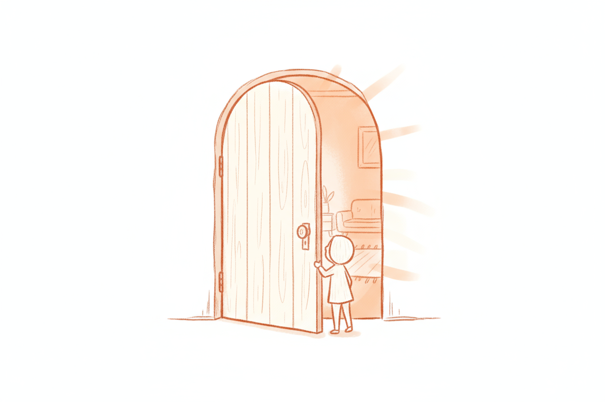

一些和gpt 对话后的记录，碎碎念

摇晃感其实更让人难受。

我尝尝自我感觉处在一种“复杂”的情绪里

“复杂”，我理解有三股情绪搅在一起，比例未知：\
1. 失落感\
2. 自我怀疑\
3. 理性压抑

这三种情绪彼此打架——既想安慰自己，又对自己的解释不太信。\
所以才会觉得“说不清楚”，心里几种声音同时在说话。

GPT 的建议是直接的。

“你现在不需要去区分哪一种声音是“对的”。更重要的是先承认：这些感受都合理。”

“失落不是失败的证据，而是方向感在更新的信号。”

认知是分层的。

**第一层：信息层（知道）**

我们大概能复述一些事实，个别概念和术语。

此时的心理状态是对知识有好奇心，但依赖外部输入，比如看文章、听播客、转述别人的观点。

**第二层：理解层（看懂逻辑）**

我们能把知识和现实联系起来，判断“为什么会这样”。

开始用知识解释现象、提出假设、做小实验。

此时的心理状态是开始形成自己的判断，但还依赖已有模型——会有判断，但缺乏分辨「判断」的能力。

**第三层：创造层（系统）**

我们能用自己的语言和经验重新定义框架。

开始构建新方法、总结（研发）新的模型。

此时的心理状态是知识已内化为直觉，可以自由迁移。

有趣的是，\
越是认真、越是对自己要求高的人，越容易觉得自己只在第一层。\
因为他们知道这个领域太大了，永远学不完。\
永远保持着**好奇和谦逊**，而不是自以为懂。

“不会不可怕，失去也不可惜；可怕的是因为一次挫折就失去学习的勇气。”

好奇与谦逊是一种持续的状态，尤其面对困难时更加可贵。

「困难与挫折」这种描述是一种 解读方式。

我们把一些事情，解读为这是一个困难的事，我需要去解决。

但为什么不换个思路呢？

比如，好奇。为什么会出现这样的事呢？

困难需要用来克服；

好奇，则需要讨论与实验。

实验更有趣一些。

GPT 说：

“站在门口觉得自己只看见门缝的人，其实已经离屋子最近。”

你已经在门口了，只是现在风有点大。\
等你哪天想进去看看，我就在这儿，陪你一起开那道门。

等你，我在，陪你。