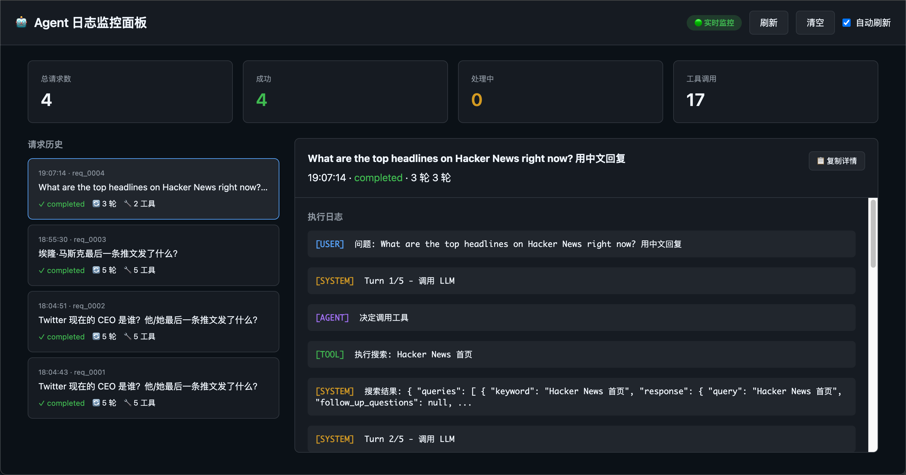

今天我在做一些 AI 产品的搭建，当然，代码部分交给我的助手 antigravity

过程中难免要做很多的迭代和修改

但问题是，我看不懂代码，也看不懂日志

这就导致，有些时候我并不清楚它改动了什么，以及，报错到底是什么原因并不清楚

以前，我会复制信息给 AI，让他解释

这是个很好的方法，但复制粘贴，还是好麻烦

有没有更方便的方法呢？

**「可视化」，visualize vibe coding**

# 方法很简单：

在你的 prompt 里加上一句：

“制作一个 HTML可视化看板，用于展示要调整的内容以及调整的逻辑，确保没有代码基础的用户也能看懂。”

比如下图

我在调试工具的时候，就做了一个终端日志的监控面板，这让我摆脱了传统的黑色终端，能够更清晰的掌握测试结果，以及评估问题。

「可视化」可以用在几乎任何AI 工作流之中！

在关键的节点，让 AI 可视化自己的操作，让人类更能理解他们在做什么，进而也帮助我们及时纠正 AI 的问题！