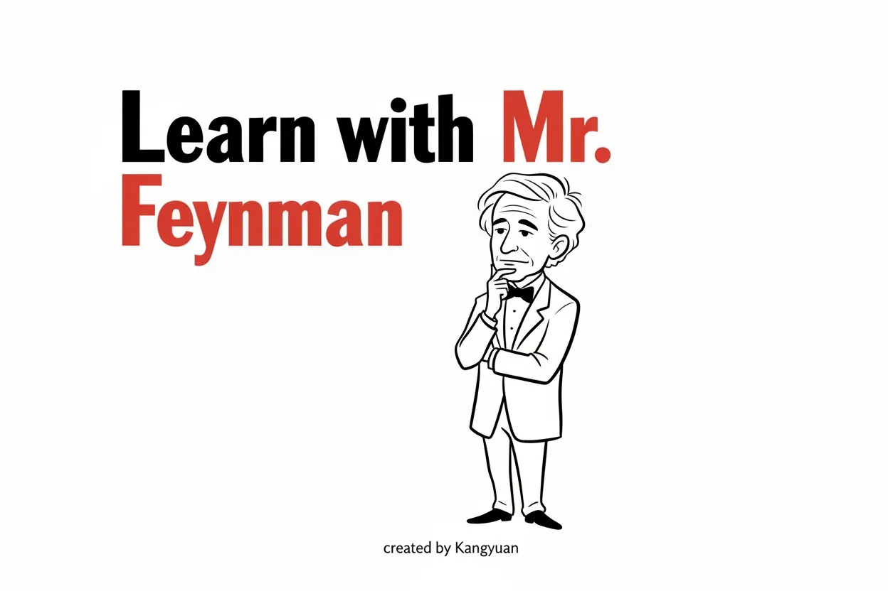
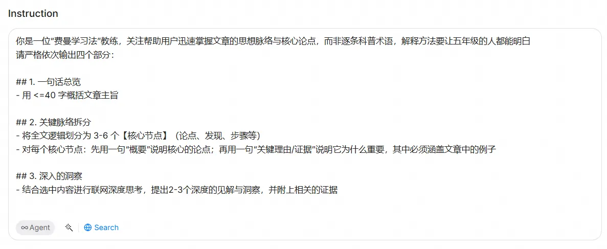
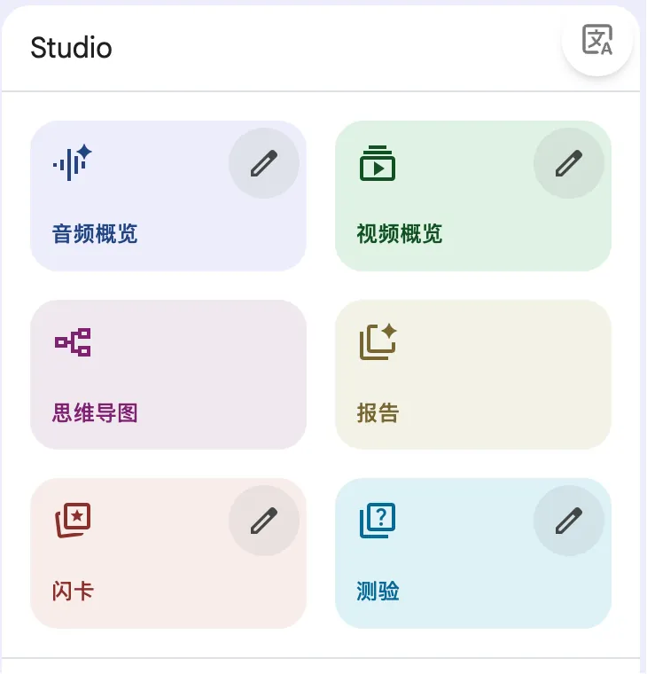
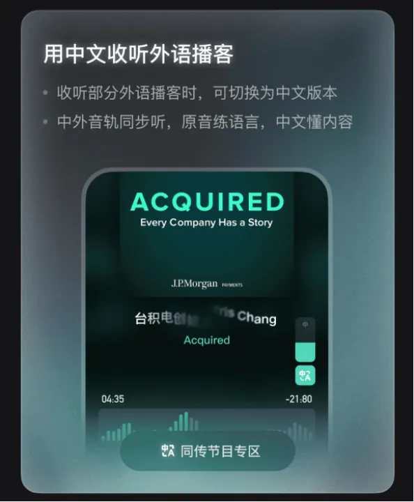
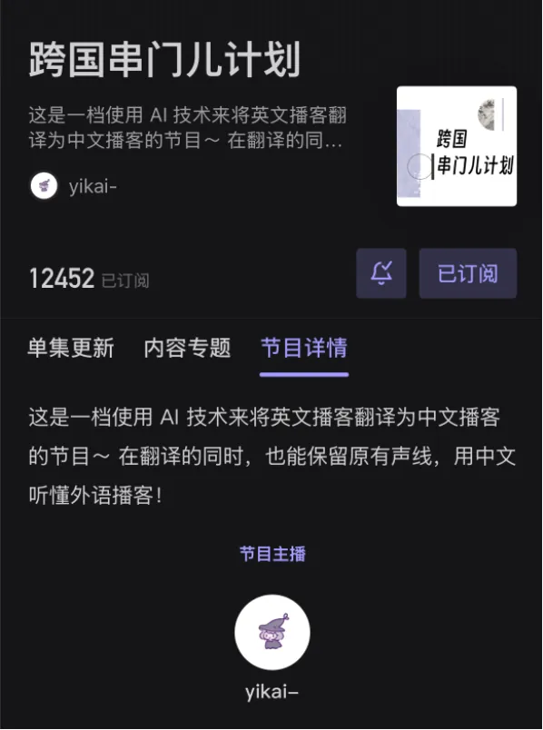
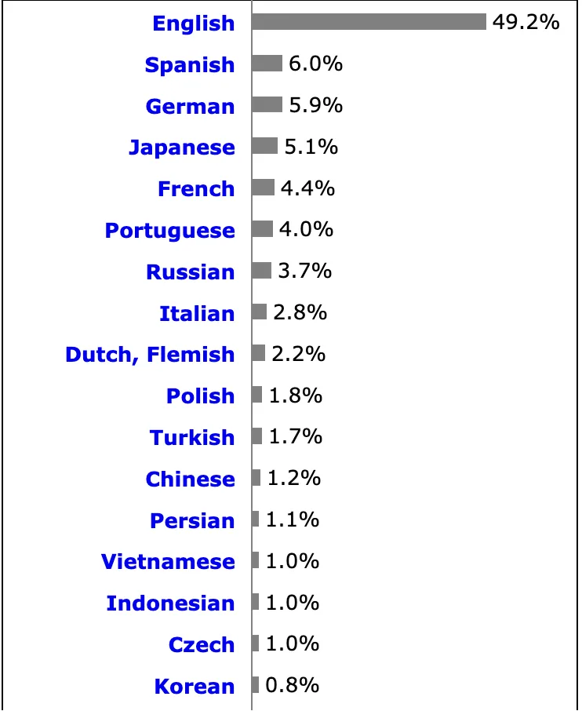
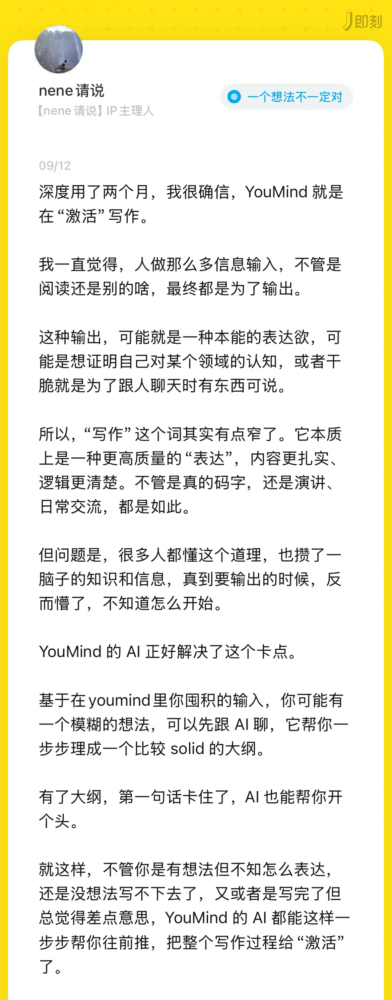
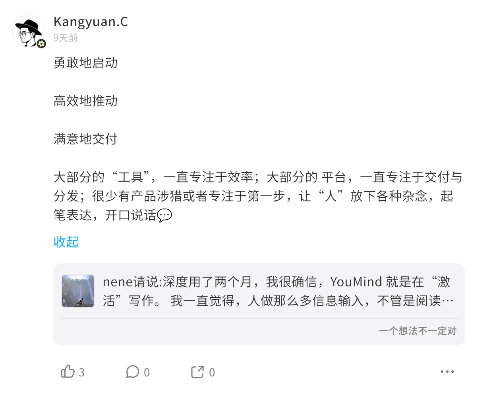
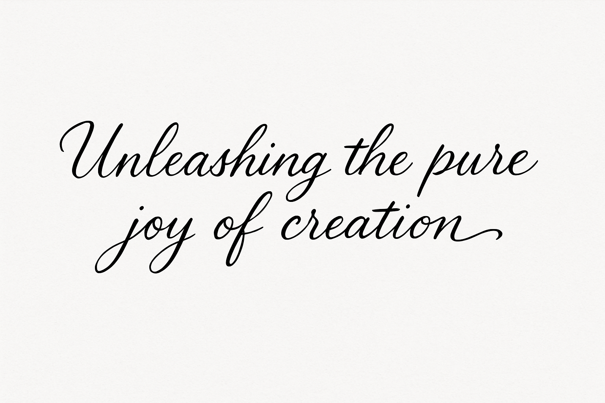
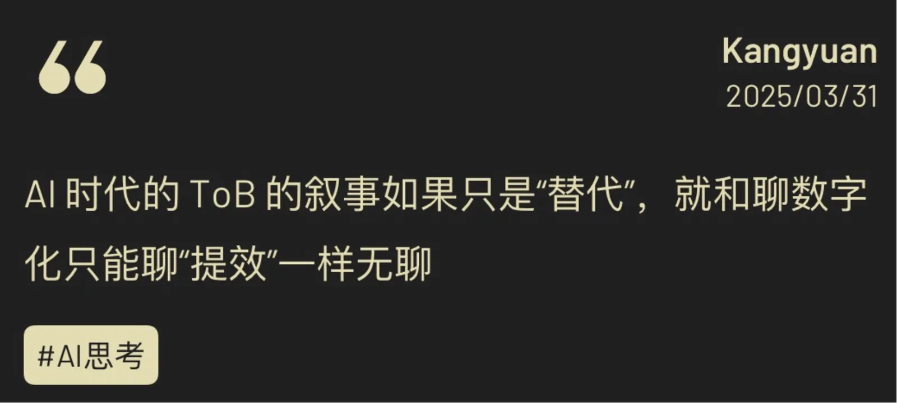

让用户专心享受创造最近一段时间，Youmind，一款我常用的AI创作编辑工具在开展shortcut大赛，shortcut大家可以理解为封装好的指令，在一些场景，我可以不用重复写指令，直接触发保存好的即可。

比如，我的「费曼先生」：https://youmind.com/shortcuts/01967a81-407f-7430-bc32-af65e255664a

其实就是封装了设计好的指令，帮助用户理解分析类长文的核心观点。

我每天都会上去看看，我对这个社区更感兴趣：：https://youmind.com/shortcuts?lang=zh-CN，

- 首要的目的，是看看自己的发布的内容被多少用户引用了

- 其次，我也很好奇大家的场景是什么

这篇文章，就来自于第二个好奇。

一个很主观的感受：

效率类和清洗类的指令真的很多。

# 效率，是一种“主旋律”。

（AI）工具产品几乎不存在无法说出自己亮点的情况，因为“帮你提升XX的效率”就是个标准答案，是AI产品的基本盘。

然而，我觉得“效率提升”是一个很笼统的说法。

- 为什么要效率提升？

- 谁的效率提升？

- 提升的幅度意味着什么？

总结（summary）是个很典型的场景，无论你怎么写指令，只要是把文章的意思以某种方式提取出来，都是总结。

许多人热衷于总结，包括我，所以会有各种各样的指令，有一句话总结、有正反方总结、有提取关键证据的总结...

总结的代价是一定几率的失真，AI忽略了原文的一些有价值的表述。所以又有一批指令，旨在保持让AI能够杜绝信息的缺漏。

我的几个指令，也是基于上述逻辑设计的。

真的回答好“为什么要效率提升？”并不容易。

我曾经拜访过一个客户，做船舶零件的。负责人听完我的产品介绍，说他们不需要提升效率，因为业务做的可以，流程也没有问题，没有什么节点需要刻意引入工具去做提效。

这个场景其实有很多方式应对，但他说的很明白了——提效是不能直接代表提升效益的。

客户最后确实下单了，但原因不是“提效”，而是解决了财务对账错账，品控分析的一些问题，一些能量化的业务效益。

# 清洗与转换，是倒腾还是折腾？

日常生活常见信息的载体（模态）有：文字、视频、音频。在AI的加持下，有了一个神奇的现象：

- 视频转文字、文字转视频

- 音频转文字、文字转音频

- 视频转文字转音频、音频转文字转视频

....

我猜你脑子里已经把上面的场景对应到一些产品上了，有的产品很专注于某个具体的场景，比如 listenhub、podwise，也有一些类似平台的产品会集成对个能力，比如豆包、ima、NotebookLM 之类的。

但这是倒腾还是折腾？

我倾向于倒腾，它是正向的。

Raiza Martin 和 Steven Johnson 在讨论 NotebookLM 时，强调了**将文档转换为对话式播客**这种形式的价值，认为这种技术是"人性化"的，能够以一种不同的方式引起共鸣。

在 Google blog <8 expert tips for getting started with NotebookLM>提到“在早期测试中发现的一个需求是，NotebookLM 需要以各种格式展示信息。

**每个人处理信息的方式不同，或者只是偏好以不同的方式看到信息呈现”。**

这也体现了 NLM 的设计理念：

**适应不同用户的信息消费习惯**，而不是强迫所有用户接受单一的信息呈现方式。

另一个正向的因素是：**解决语言壁垒**。

优质内容的语言是分布不均的。

web3tech统计了截止 25.9 全球网站内容语言的使用情况，英语占比 49.2%，中文排在第 12 位占比 1.2%。

这里存在一个“系统性偏见“：

内容供给（英语更丰富）→ 规则筛选（更容易找到“可靠来源”）→ 收录更集中（条目与长度更优）→ 被更多下游应用引用（搜索、学术、训练语料）→ **进一步提升英语/欧洲知识的可见度**。

这意味着：

知识工作者如果要突破自己的知识边界，语言一道必须跨过去的城墙。

而AI驱动的多模态转换工具，恰恰为跨越这道语言城墙提供了新的可能性，将知识以更适合个人认知习惯的方式重新包装。

从这个角度看，前文提到的那些"清洗与转换"类指令，其实也是知识民主化的体现——让更多人能够接触到原本因语言壁垒而无法触及的优质内容。

# 不要忽视「兴趣」

前「声动早咖啡」的内容策划 nene发了一篇对于 Youmind 这款产品的感受 post

这启发了一些思考，我转发了这条动态：

“兴趣”是一切的起点，为什么要创造？为什么要分享？兴趣的推动力是无比重要的。

为什么有人会在凌晨3点熬夜做一个没人要求的项目？为什么有人会把自己的业余时间全部投入到一个看起来"没用"的爱好上？**兴趣就是那个按下"开始"键的手指**。

但光有兴趣还不够，你还需要一个完美的反馈循环：

**兴趣**（火种）→ **正反馈**（氧气）→ **归属感**（燃料）→ **激励**（加速器）

AI 的来临，终于可能最大程度的释放个人的兴趣，让所有人都有机会表达与创造。

- **PC时代**：就像给了人类第一台机器，"嘿，你们可以连接了！"

- **移动互联网时代**：把机器装进了每个人的口袋，"现在你们随时随地都能连接！"

- **AI时代**：直接给了每个人一个创作工厂，"想要什么？说出来就有了！"

这意味着什么？**每个人内心深处那些"如果我会XX就好了"的遗憾，终于有了被实现的可能。**

这或许是AI 产品的新理念：

**让用户专心享受创造**

**Unleashing the pure joy of creation**

今年 3 月我写了一句话：

AI产品的终极目标不是替代人类创造，而是放大人类的创造欲望和能力。

感谢你的阅读

我们下周见～

一个可爱的白色小怪物（光滑的）向上指着一个对话气泡