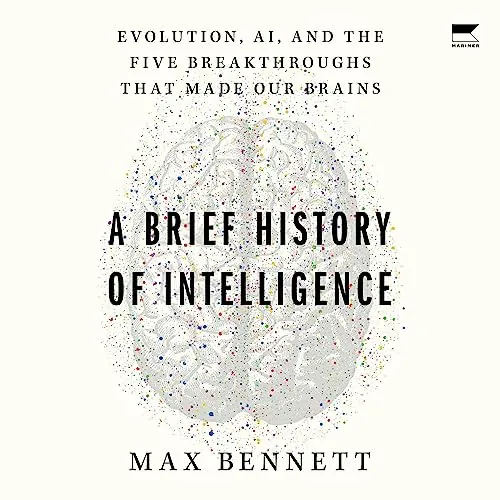
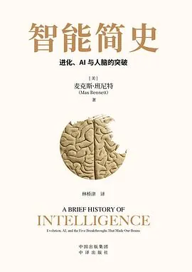
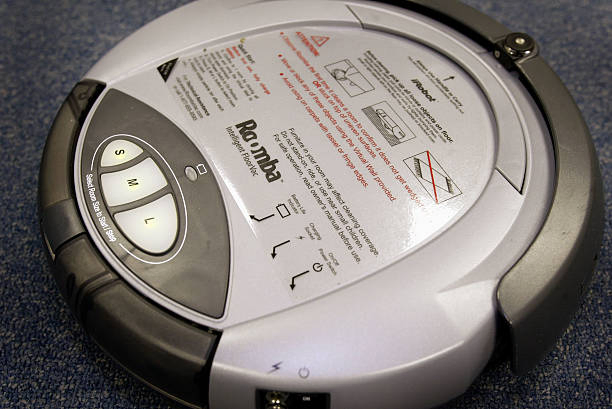
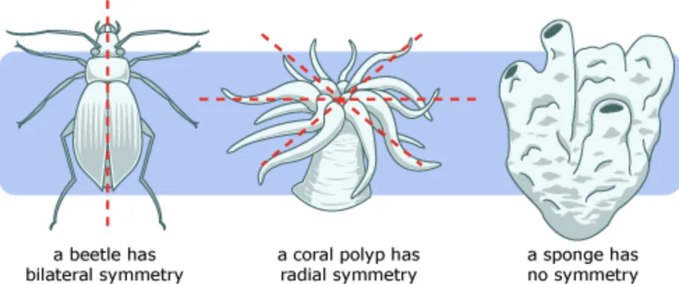
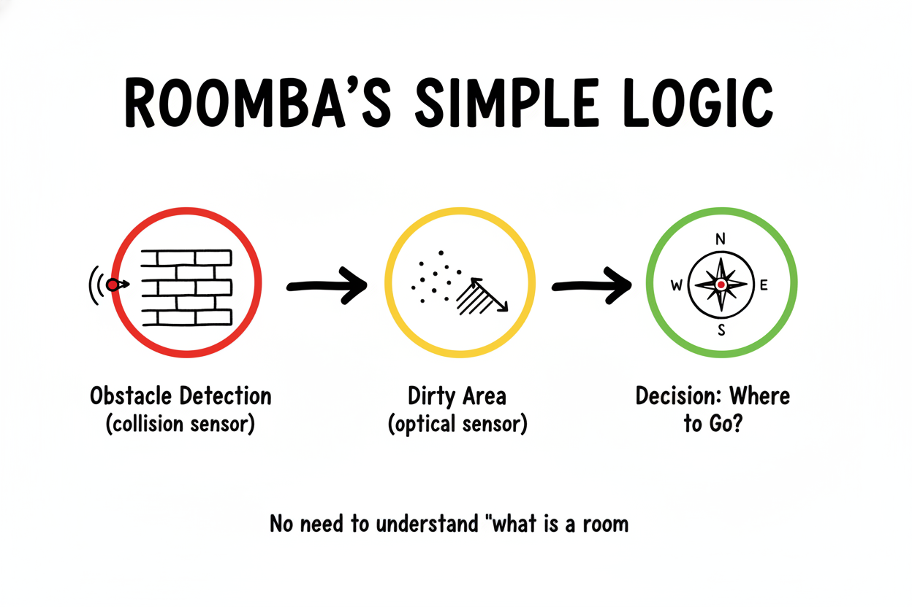
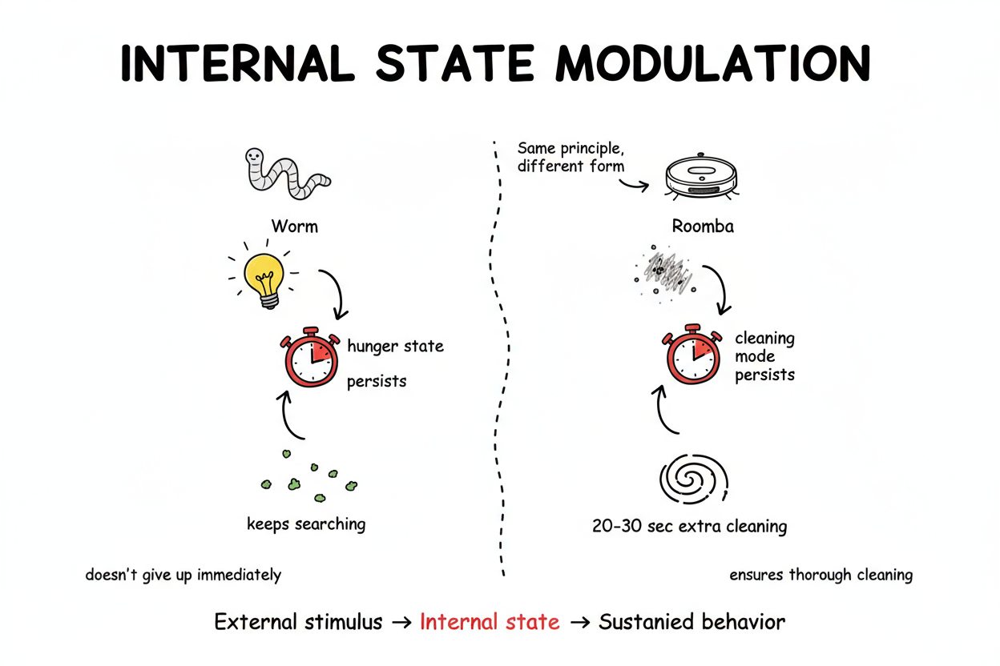
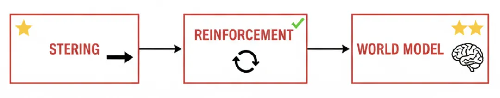

**最近在读一本书，突然想到一个问题：​为什么我们总想一开始就构建完美的系统？**

**这本书叫《智能简史》（*A Brief History of Intelligence: Evolution, AI, and the Five Breakthroughs That Made Our Brains*），作者 Max S. Bennett ，AI 创业者，现任 Alby 联合创始人兼 CEO，之前是 Bluecore（电商场景的 AI 公司）的联合创始人兼首席产品官（CPO）。**

**书里有个故事，关于 Roomba 扫地机器人​。**

# **一个"笨"机器人的智慧**

**Roomba 是由美国 iRobot 公司在 2002 年推出的自动扫地机器人，全球销量已经超过 4000 万台​，是消费级机器人的标杆产品。**

**第一代 Roomba 真的很"笨"，它只配备了基础的红外传感器和碰撞检测器，不知道房间长什么样，不会建地图，也不懂家具的位置。**

**它只会：**

**- 沿着墙壁走（壁随行为）**

**- 在开阔地方转圈圈（螺旋式清扫）**

**- 撞到东西就换个方向**

**- 遇到脏的地方就多转几圈**

**这个"笨办法"却比那些试图"理解房间"的复杂方案更成功。**

**为什么？**

# **6亿年前的生物**

**Bennett 在书里讲了一个更古老的故事。**

**6 亿年前​，地球上出现了第一批拥有大脑的生物，线虫。它们的大脑只干一件事：​决定往哪走​。**

**线虫有个简单到极致的规则系统：**

**闻到食物 → 往那边游**

​**遇到危险 → 往反方向跑**

**最初的大脑没有各种复杂的机制，只有"好"和"坏"两个标签，生物学家称之为​"价态（Valence）"。**

**但就是这么简单的机制，支撑了生命进化的第一个智能突破​。**

**为什么会这样？**

**书里提到，在线虫之前，海里都是些水母、海葵。它们没有"前后"的概念，因为它们是辐射对称的（360度都一样）。**

**它们不需要"决定往哪走",因为哪个方向都行。**

**当生物开始主动觅食,需要追逐食物时,两侧对称结构就成了必然选择，因为感知器官集中在前端,形成"头部",这样才能更高效地探索环境。​**

**但一旦你长成了有"头尾"的形状(两侧对称)，问题就来了:​你只能朝一个方向走,所以必须决定这个方向是什么。**

**这就是为什么大脑诞生：​不是为了思考，而是为了决定往哪走。**

# **Roomba 与线虫**

**90 年代初，Rodney Brooks（MIT AI 实验室成员，iRobot 创始人）有个有趣的思想实验：**

**> 假设现在是 1890 年代，人工飞行是最热门的研究方向。一群科学家被时光机送到 1990 年代，坐了几个小时波音 747。**\
**>**\
**> 回到 1890 年代后，他们激动万分："我们知道飞行能实现了！"**\
**>**\
**> 于是他们开始复制 747 的一切：倾斜的座椅、双层玻璃窗、那些神奇的"塑料"材质。**\
**>**\
**> 他们以为只要把这些细节搞定，就能造出飞机。**

**但他们关注了<u>完全错误的东西</u>。**

**飞机能飞，不是因为座椅舒适或窗户漂亮，而是因为伯努利原理、升力和推力的平衡、翼型设计等更加本质的原理。**

**Brooks 说，试图通过逆向工程人类大脑来构建人工智能，犯的是同样的错误。**

**人类大脑太复杂了，如果你一开始就想复制它，就像 1890 年代的人想直接造 747 一样被表面的复杂性迷惑，反而错过了真正重要的原理。**

**Brooks 提出了一个更好的方法：**

**> "incrementally build up the capabilities of intelligence systems, having complete systems at each step."**\
**> "逐步构建智能系统的能力，在每一步都有完整的系统。"**

**换句话说，像进化那样：从最简单的大脑开始，然后逐步增加复杂性。**

## **Roomba的诞生**

**Rodney Brooks 正是Roomba 的设计者。**

**他的理念很简单："不要试图先造一个懂房间的'脑'，而是先让它能工作。"**

**这对应了生物进化的第一个突破：​转向（Steering）。**

**线虫不需要理解"食物是什么"，它只需要：**

**检测到食物气味的浓度梯度 → 判断"这个方向好坏（正负价态）" → 决定往哪边游**

**Roomba 同样不需要理解"房间是什么"，它只需要：**

**检测到障碍物（碰撞传感器） → 检测到脏的地方（光学传感器） → 决定往哪边走**

## **"持续状态"的设计**

**线虫的饥饿状态：**

**当线虫饿的时候，它会进入一种"觅食模式"，即使暂时闻不到食物，它也不会立刻放弃。**

**这个"饥饿状态"会持续一段时间，让它在附近继续搜索。**

**Roomba 的"脏地探测模式"也是同样的方式：**

**当光学传感器检测到大量灰尘/碎屑时，Roomba 进入"污渍清洁模式"。**

**即使传感器显示当前区域已经变干净，它也会在周围继续螺旋式清扫，持续 20-30 秒，确保彻底清洁**

**这是同一个智能原理在不同载体上的体现。**

**这是"内部状态调制"（Internal State Modulation）：外部刺激不是直接触发行为，而是通过改变内部状态来间接影响后续的决策。**

**这个简单的机制带来了巨大的生存优势：**

**- 对线虫：​避免因为暂时的信号中断就放弃觅食**

**- 对 Roomba：​避免因为局部清理就遗漏整个脏区域**

## **为什么这个"笨办法"成功了？**

**Brooks 的方法遭到了很多质疑。传统研究者认为机器人应该先建立房间的完整模型，再规划最优路径。**

**Roomba 抓住了本质：可用性、稳定性、商业化**

**就像 Brooks 说的："商业机器人进化的第一步，和大脑进化的第一步是一样的——​都是从'转向'开始​。"**

**第一代 Roomba完成了最小可行的智能闭环​。**

# **不要试图一开始就构建完美的系统**

**我们经常容易陷入一个思维陷阱：​**

**想一开始就把所有场景考虑清楚，把系统设计得"完美"。**

**但 Roomba 和线虫的故事告诉我们：**

**1、先能动起来，完成最小任务的闭环**

**第一代 Roomba 没有 SLAM（即时定位与地图构建），没有视觉识别，没有路径规划——但它覆盖率能达到 85%，远超那些想"理解房间"但容易失败的复杂方案。**

**2、简单+稳定 > 复杂+脆弱**

**复杂系统在理想情况下确实更优，但现实世界充满意外。**

**简单规则虽然不完美，但它稳定、可靠、便宜，这也是能规模化的关键。**

**3、进化是渐进的**

**生物智能不是一蹴而就的，它是从最小可行闭环开始，一步步叠加能力：**

**先有简单的转向能力（steering），再通过反馈强化（reinforcement）改进，最后才发展出复杂的世界模型（world model）**

**有时候，"笨办法"恰恰是最聪明的选择。**