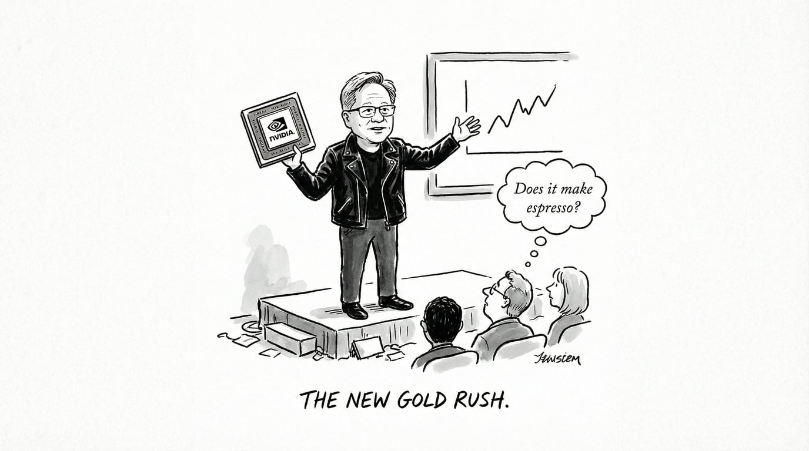
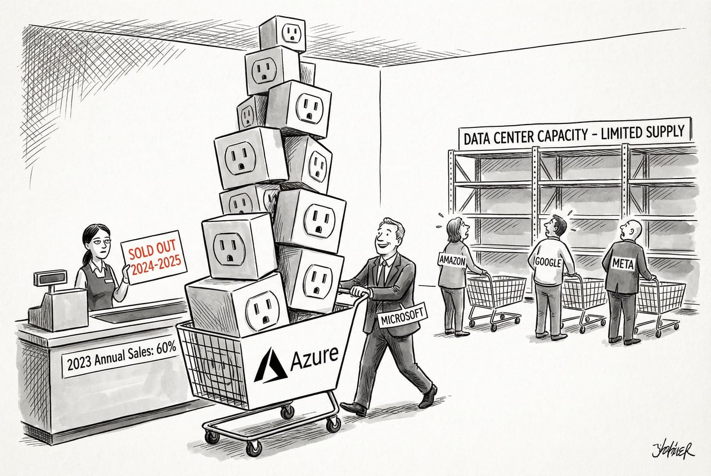
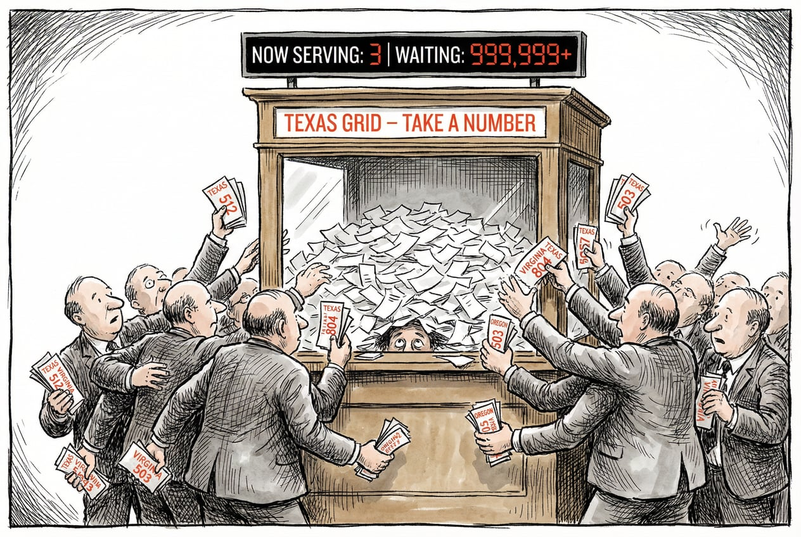
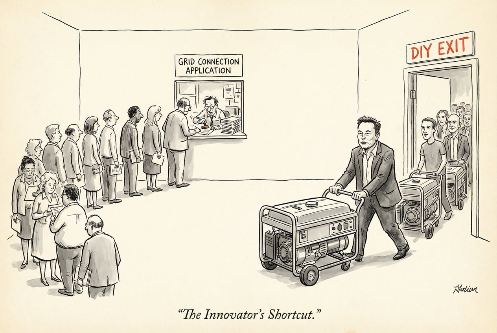
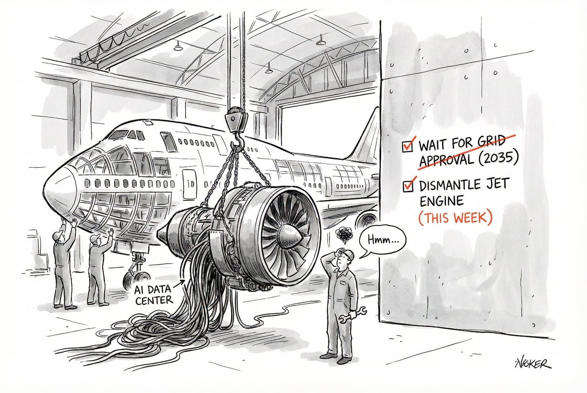

今天这篇文章来自 2026 年初 SemiAnalysis 两位能源基础设施研究员的深度访谈。

访谈对象是 Jeremie Eliahou Ontiveros 和 Ajey Pandey.

Jeremie 此前是欧洲买方分析师，目前主要负责数据中心与能源基础设施研究团队。

Ajey 来自市政电力公司,学的是电气工程。他在佛蒙特州伯灵顿市工作时负责的电网峰值负载是 50 MW,现在一个常规 AI 数据中心的负载等于"10 个伯灵顿"。

这篇文章核心讨论的问题是：

**当 AI 数据中心的电力需求以指数级增长，而传统电网无法跟上节奏时，科技公司如何自己动手解决电力问题？**

# 一、倒推法发现的危机：Nvidia 就让行业翻倍

这个故事要从一个研究方法说起。

大部分机构预测数据中心能源需求时，用的是线性增长模型——假设每年增长 10% 或 15%，这是标准做法。

SemiAnalysis 团队换了个思路：既然 AI 数据中心的爆发是由 GPU 驱动的，为什么不直接统计 Nvidia 出货了多少芯片，然后乘以每颗芯片的功耗？

算出来的数字让所有人都愣住了。

2019 到 2022 年,全球数据中心行业每年新增电力容量大约 4-5 GW。这包括所有类型:社交媒体、云计算、各个地区加起来的总和。

2024 年,Nvidia 一家公司出货的 GPU 需要 5 GW 电力。

> “Nvidia 一家公司，就让整个行业的规模翻了一倍。”

问题随之而来：

这些电从哪来？数据中心建在哪？冷却系统跟得上吗？变压器够不够？电工够不够？

Jeremie 的团队开始用卫星图片逐个追踪全球数千个数据中心的建设进度。

他们发现，光看卫星图就能判断一个数据中心的电力系统和冷却方案，他们并基于此预测云服务商季度收入。

他们甚至能提前预判亚马逊 Q3 的增长加速，因为他们看到了亚马逊新数据中心的通电时间表。

这种方法之所以有效，是因为当前市场里**供给决定收入**。

只要数据中心通电了,收入基本就锁定了,因为需求远超供给。每通电一 MW,你就能算出对应的芯片数量,再算出能产生多少收入。

这个逻辑会一直有效，直到供给超过需求。

# 二、疯狂的Microsoft：2023 年租走全行业 60% 的容量

谁最早看到了这个趋势？

**Microsoft，毫无疑问。**

2020 年，Microsoft 向 OpenAI 投资 10 亿美元。2023 年初，ChatGPT 爆火后，Microsoft 又追加了 100 亿美元。

但投资只是表面动作，真正的信号藏在数据中心租赁市场里。

数据中心有两种建设模式：自己建，或者从第三方运营商那里租。租赁市场的玩家包括 QTS、Digital Realty、Equinix 这些老牌厂商。

2023 年，Microsoft 在租赁市场的表现只能用“疯狂”来形容。

全年，Microsoft 一家租走了北美市场 **60% 的可用容量**。

2023 年 Q3,Microsoft 单季度租下了 2 GW,这相当于 2022 年整个北美市场全年的租赁总量。

同时，Microsoft 还在全球范围内大规模启动自建数据中心项目。从 2023 年开始，他们在美国各地和国际市场同时开工，建设周期通常需要一年多。

这些决策的结果在 2024 年底到 2025 年初开始显现：

**Microsoft Azure 的云业务增速明显加快**，因为那些在 2023 年租下和开建的容量，陆续上线了。

其他巨头呢？都慢了一拍。

**Meta 最惨**。

他们过去十年一直在建 H 型数据中心——150 MW,五栋楼,全风冷,能效比做到了行业最低。

但问题是：这种设计完全不支持液冷，而 <u>GPU 集群需要液冷</u>；更要命的是，<u>建设周期要两年半</u>。

当 Meta 意识到问题时，他们做了一个激进的决定：把一个已经开工的数据中心推倒重建，换成适配 AI 负载的新设计。

直到 2024 年下半年，Meta 才真正开始大规模上线 AI 算力。

Amazon 和 Google 也都晚了，只是程度不同。

这场竞赛里，**反应速度决定了未来 18 个月的竞争格局**。

# 三、德州困局：每月涌入数十吉瓦申请，只批准了 1 吉瓦

电力短缺是当下正在发生的现实。

仅德克萨斯州,每个月就有数十 GW 的数据中心电力申请涌入。

过去 12 个月，真正获批的只有 1 GW 多一点。

**电网卖光了。**

但这里有个吊诡的地方：到底是真的没电了，还是被流程卡住了？

答案是两者都有，但更大的问题是**囚徒困境**。

当你向电力公司申请接入时，需要经过配电、输电、电网运营商三方协调，跑一套复杂的负载模拟。

这个过程本身就很慢，而且经常会发生这种情况：等你的审批快完成时，又有新项目上线了，你得重新排队。

更糟糕的是，因为大家都不确定能在哪里拿到电，所以**每家公司都在全国各地疯狂提交申请**。

德州有申请，弗吉尼亚有申请，俄勒冈也有申请。

**这导致整个系统被垃圾请求淹没。**

统计下来，美国全国的数据中心电力申请总量接近 1 TW，相当于美国电网峰值负载的两倍。

显然，这些申请大部分是假的，或者说是**占坑性质**的。

但正是因为大家都在占坑，真正的需求反而更难被满足。

这就是囚徒困境：**如果大家能协调，问题会容易得多；但因为每个人都在自保，整个系统陷入了恶性循环。**

德州正在立法解决这个问题，要求申请方披露更多信息，筛掉那些“拿着 100 英亩地就想招商引资”的投机者。

但即便清理掉噪音，硬件层面的约束依然存在：

变压器、开关设备、燃气轮机，这些东西的交付周期都在拉长。

GE Vernova 的 H 级燃气轮机？订单已经排到 2029 年了。

# 四、马斯克的奇迹：重新发明数据中心

在所有人都在抱怨电网太慢的时候，马斯克用四个月在孟菲斯建成了一个 300 MW 的数据中心。

他怎么做到的？

**第一性原理：不依赖电网，自己发电。**

2024 年初，xAI 想进入 AI 竞赛，但已经晚了。

马斯克跟 Oracle 等云服务商谈过，对方说最快 2025 年中才能给你电。

马斯克的反应是：那我自己搞。

第一步，别建新楼了，找个现成的。他们找到了孟菲斯一个旧家电厂房，直接改造。

第二步，别等电网审批了，自己发电。但怎么快速搞到发电设备？

马斯克没有去订那些需要等两年的大型公用事业级燃气轮机。他找到了一家**涡轮机租赁公司**，对方手里有现货库存。

这些是模块化的小型燃气轮机，几周就能部署到位，接上燃气管道就能发电。

四个月后，xAI Colossus 数据中心上线，**成为全球第一个 GW 级的 AI 训练集群。**

这套打法被称为“棕地+桥接电源”模式：

- **棕地**（Brownfield)：利用旧工业用地，跳过新建审批。

- **桥接电源**（Bridge Power)：先用现场发电撑着，等电网接入批下来再切换。

传统数据中心行业的人觉得这是疯了。

> “我去参加行业会议，所有人都说不应该这么干，从房地产角度看这不合理。”

但 AI 实验室的人全都觉得马斯克是天才。

OpenAI、Anthropic、所有 AI Labs 都开始模仿这套方法。

现在，**AI 实验室在数据中心建设中的话语权越来越大**，他们正在重新定义这个行业的游戏规则。

# 五、一场意外的电网革命

最初，大家都把现场发电当作临时方案。

等电网接入批下来，这些燃气轮机就转为备用电源，主要电力还是从电网取。

但现在情况在变。

越来越多的公司发现：电网承诺的接入时间不断推迟。

2027 年底？不好意思，现在是 2028 年底。过几个月再问，可能变成 2029 年，甚至 2035 年。

**电网变得不可靠了。**

这逼着公司开始规划**完全脱网的数据中心**。

不再是桥接，而是长期运行。

这意味着设备选择会发生变化：

不再是那些适合快速启动的小型模块化涡轮机，而是那些能跑 20-30 年、效率超过 60% 的大型联合循环燃气轮机（H-class CCGT）。

成本更低，但系统更复杂，需要自己管理冗余备份。

从卫星图和许可文件来看，已经有数据中心在为 2027-2028 年规划完全脱网的电力方案。

这带来了新的供应链瓶颈：**燃气轮机、往复式发动机、开关设备、变压器，所有这些设备的交付周期都在拉长，价格也在上涨。**

但市场的反应也很快。

**一家叫 Boom Supersonic 的公司，原本造超音速飞机的，现在宣布要给 AI 数据中心提供燃气轮机——签了 1.2 GW 的订单。**

还有公司在拆退役的波音 747，把飞机上的涡轮发动机改装成发电机组。

这听起来很疯狂，但算一笔账就明白了：

Oracle、CoreWeave 这些云服务商,每 GW GPU 集群每年能产生约 **120 亿美元收入**。

如果你能提前六个月上线，哪怕电费贵一倍，也完全不是问题。

因为 GPU 集群的主要成本是硬件，也就是 Nvidia 的毛利。电费翻倍？影响不大。

**速度才是一切。**

而这场竞赛正在波及更广泛的经济：数据中心抢走了电工、管道工；燃气轮机订单挤占了集装箱船和喷气式飞机的发动机产能。

**AI 基建正在重塑整个工业供应链。**