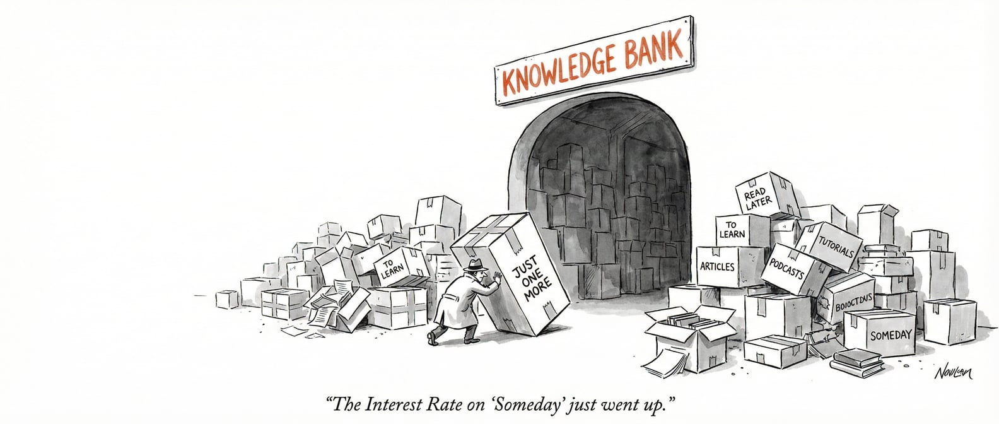

## 窦文涛的三张桌子

原本想写写“注意力涣散”和“缺乏决断力”，这两座压在人头上的大山。

但写着写着，我开始思考一个现象：

<u>每天摄取海量信息，产出却寥寥无几。</u>

在《圆桌派》第八季第一集，窦文涛说这是“**知识贪婪**”。

他描述了一个自己场景：

> 家里摆着三张桌子，各放一摞书。每天这翻一页，那翻一页，结果一本也读不完。这简直是我的生活写照。

## **这种“知识贪婪”，是对生命有限性的恐慌。**

我在科技圈工作，每天都会摄取大量的信息。

朋友问每天为什么要花这么多实时间，我解释是

“我得了解行业最前沿，否则怎么做产品？怎么和客户对话？”

但深挖下去，我意识到这是一种“不看就要落后”的绩优主义焦虑。

时间有限，必须在一分钟内读完一小时的内容。

**关键不在于「信息摄入后的行动是什么？」，而是「必须要有大量摄入这个动作本身」**

我曾经简单讨论过对于 AI 总结的看法。

把 4 小时的播客扔给 AI，瞬间生成几百字摘要。

“懂了，信息获取了，省了 4 小时。”

这逻辑很荒谬。

**我们把内容消费变成了任务清单，却剥离了体验本身。**

## 快消时代的病症

快消时代，信息从“长度”转向了“密度”。

以前我们花一小时读一篇 1w 字的报道，了解事情的来龙去脉。

现在我们看 15 秒短视频，极快的语速，极高的密度。

密度提升了，但思考并没有变深。

反而形成了一个恶性循环：**你越摄取，越觉得自己落后；越落后，越焦虑。**

这种焦虑衍生出三种典型症状。

### 第一种：收藏癖加“完成恐惧症”。

看一眼浏览器收藏夹和“稍后阅读”列表吧。文章太长？先收藏。

课程不错？先买了。

**“保存即阅读”，这是最大的自我欺骗。**

囤积，是因为害怕错过，更害怕面对“永远读不完”的事实。

只要存下来，就保留了“万一哪天我会看”的幻觉。

### 第二种：多线程焦虑。

很难一口气读完一本书。

手头同时开着四五本。看小说时觉得该看工具书，看工具书时觉得该看财报。

做一件事，脑子里跑着十件事的进度条。

什么都想抓住，结果什么都抓不住。**看起来很忙，但实际注意力早已支离破碎。**

### 第三种：深度恐惧症。

无法静心看完一部两小时的电影。觉得慢，觉得亏。

心里有个奇怪的算式：花一小时看一篇文章是浪费，看三篇摘要才是赚。

理性的大脑知道深度思考需要时间，需要慢下来。

但感性的焦虑不允许。

它像鞭子一样抽着你：快，再快点。

## 求助AI

AI 给了我三个问题，还挺有意思的。

**问题一：你的贪婪是真实需求，还是逃避焦虑？**

> 不停摄取信息,可能是一种逃避机制——只要我在"学习",我就不用面对"我还没开始做"的事实。

**问题二：你能接受这辈子注定有很多东西不知道吗？**

> 有限性才是价值的来源。如果你能活一千年，你根本不会焦虑今天没看完这本书。
>
> 区分哪些是“必须知道”，哪些是“无所谓知道”。

**问题三：你害怕的到底是"不知道",还是"不被需要"**

> 囤积知识,本质上是在囤积"被需要的资格"。
>
> 害怕某天别人聊到一个话题,你插不上嘴;
>
> 害怕会议上别人都懂,只有你不懂。

你的回答是什么？