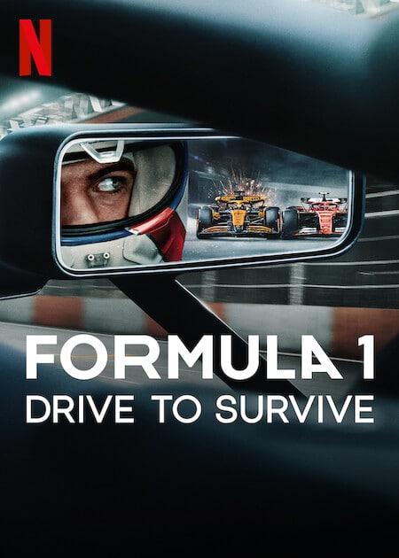
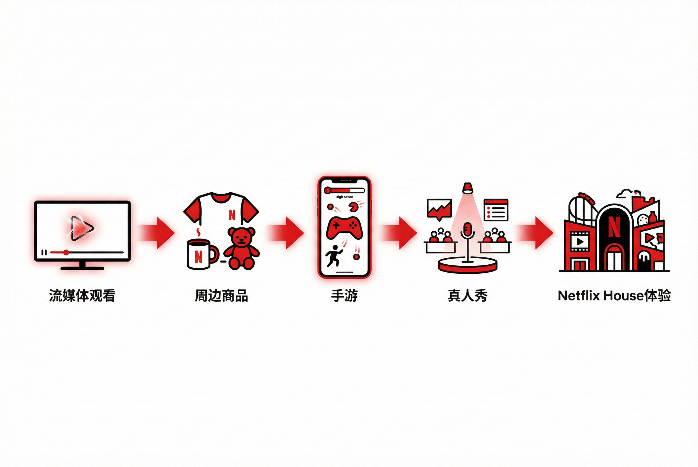

2025 年 12 月 5 日，全球流媒体巨头网飞（Netflix, Inc.）宣布与华纳兄弟探索（Warner Bros. Discovery, WBD）达成最终协议：

以约 827 亿美元的企业价值（包含债务）收购后者旗下的影视工作室及流媒体资产。

本次交易结构极其复杂，涉及 WBD 将其传统线性电视网络（如 CNN、TNT、Discovery 频道）剥离为一家独立的上市公司“Discovery Global”。

**而网飞将吞并 WBD 包括拥有百年历史的华纳兄弟影业、HBO 品牌、HBO Max 流媒体服务、DC 影业以及高利润的游戏部门**。

# 为什么是现在？——Netflix 的增长困境

## 用户增长的天花板

从 2020 年开始，Netflix 保持了非常强劲的订阅用户增长，在 2024 年更是达到历史新高。

但天花板是存在的。

**成熟市场的饱和**：从全球市场上看，北美、欧洲等核心市场渗透率已达高位，北美 40%家庭已订阅 Netflix，自然增长空间有限。

**增长被透支**：2024 年，Netflix 开展了对密码共享的打击，以及广告业务的大力推进，但策略带来的增长并不可持续，特别是前者，属于一次性策略。

2024 年 10 月，Netflix 宣布**从 2025 年第一季度开始停止公布季度订阅用户数**，转而强调**收入和利润率**作为核心业绩指标。

Netflix 的用户增长并非停滞，而是进入了一个**边际递减、依赖<u>非常规手段</u>维持增速**的阶段。

## 内容成本的上升

优质内容的制作成本是非常高的。

**Netflix 是全球流媒体原创内容投资支出的第一名。**

2016-2019 年的激进扩张期，Netflix 内容支出占收入的比重高达 70%-80%。

2020 年后，这一比例稳定在 40% 左右，但年均支出仍超过 150 亿美元，用于原创制作和版权采购，这始终是 Netflix 最大的成本项。

2025 年，内容支出高达 180 亿美元，而 CFO Spencer Neumann 明确表示：

> 180 亿美元"远不是天花板"(not anywhere near a ceiling)

## 广告业务的困境

2022 年 11 月，Netflix 推出带广告的分层订阅。

广告业务的数据看起来很亮眼：

但其面临两个根本性问题。

**1、规模难以支撑增长**

尽管广告业务增速很快（每年翻倍），但与真正的广告巨头相比，Netflix 仍然是个"小玩家"：

对比一下 YouTube 和 Netflix 的广告业务

即使 Netflix 广告业务每年翻倍增长，要达到 YouTube 的规模也需要 3-4 年。

Netflix 自己也承认：**至少到 2026 年，广告都不会是公司收入的第一现金牛**，更多是"正在加速的第二曲线"。

CFO Spencer Neumann 在电话会议中也表示，广告业务"需要时间来建立规模"。

**2、价值观与 ARPU 的稀释**

Netflix 曾经的核心价值主张是：无广告体验、优质内容随时观看、用户为优质内容付费。

 而如今，基于广告业务的分层订阅体系从根本破坏了这一个价值主张。

广告业务同时带来了 ARPU （**每用户平均收入）**被稀释的风险。

带有广告的 ARPU 显著低于无广告层的。

在“降级消费”的背景下，如果越多新用户和老用户选择广告层，那么虽然广告收入可以部分弥补，但**短期内难以完全抵消 ARPU 下降带来的损失**。

# 价值的创造与拥有

## 价值创造者≠价值拥有者

F1 的故事是一个绝佳的案例。

2018 年，F1 的美国转播权几乎没人要，Liberty Media（自由媒体集团）只能免费送给 ESPN。

然而 2019 年，Netflix 制作的纪录片《极速求生》让 F1 在美国市场爆火。

结果呢？

2025 年，苹果以每年 1.5 亿美元的价格抢下 F1 转播权——坐收渔利的是 Liberty Media，而不是 Netflix。

Netflix 擅长使用自己的算法推进和平台流量，把一部影视作品（无论新/老）打造成现象级的作品。

Netflix 创造了价值，却无法享有增值的回报，或是不得不为此支付更高的版权费，甚至可能面临内容被收回的风险。

Netflix 上的经典剧集如《绝命毒师》《风骚律师》，版权归属索尼电视；

韩剧是 Netflix 全球化成功的关键支柱，但《鱿鱼游戏》《黑暗荣耀》的真正内容源头是韩国三大电视台（KBS、MBC、SBS）**和 CJ ENM**（tvN 母公司）。

Netflix 在韩国累计投入超过 30 亿美元，买的是**播放权**，不是**所有权**。

**作为技术公司，Netflix 擅长创造价值；但作为非内容所有者，它无法锁定价值。**

## 好莱坞的 IP 宝库

**当增长开始放缓，内容库（IP）才是留住用户、驱动参与度的核心资产。**

早期的 Netflix 或许低估过 IP 的长期价值，他们专注于**订阅增长**而非 **IP 所有权。**

但随着 2011 年 Starz、2017 年迪士尼撤回授权内容，2018 年为保留《老友记》版权，支付 **1 亿美元**（是之前 3000 万的 3 倍多），Netflix 开始打造自己的原创 IP。

> "迪士尼目录、老友记、办公室和其他授权内容将在未来几年逐渐消失，**这将释放预算用于更多原创内容**"——Q2 2019 财报信

Netflix 目前成功的原创 IP 包括：

**鱿鱼游戏、怪奇物语、布里奇顿、星期三、王冠、黑镜、爱、死亡与机器人、KPop Demon Hunters 等**

但也有失败的：

**反叛之月、朱庇特传奇、星际牛仔、致命钥匙、1899 等**

还有一些正在打造的：

**纳尼亚传奇、海贼王真人版、三体**

**对比一下华纳的 IP 库**

在影视领域，华纳拥有：哈利波特/魔法世界 、指环王/中土世界、黑客帝国、疯狂的麦克斯、沙丘、权力的游戏、老友记、生活大爆炸、欲望都市、黑道家族……

在漫画领域，华纳拥有 DC 宇宙旗下的英雄角色、DC 漫画公司其他角色

在动画领域，华纳拥有：兔八哥、猫和老师、史酷比、飞天小女警、瑞克和莫蒂……

## IP 的复利效应

老牌 IP 随着时间推移，不仅不会贬值，反而能够通过**多维度变现**和**跨代际传承**产生越来越大的累积价值。

以华纳的“哈利波特系列”IP 为例。

哈利波特出版 28 年，总价值已超过 **250 亿美元**。

**空间维度**上，哈利波特 IP 从屏幕延伸到实体空间，环球影城的哈利波特园区每年吸引数百万游客前来"朝圣"。

> **华纳兄弟**拥有哈利波特的电影改编权和大部分商业开发权，但在主题公园领域，它把权利**授权**给了环球影城。

**产品维度**上，IP 衍生至玩具、游戏、服装、食品等全品类，乐高哈利波特系列就创造了 24 亿美元的利润。

**情感维度**上，“哈利波特”实现了跨代际的情感传承，父母与子女都是哈利波特的忠实粉丝。

**WordsRated **数据显示，32%的美国 18-34 岁成年人读完了全部七本哈利波特。

有三个关键因素支撑 IP 的复利效应。

**1、可延展的世界观**

IP 需要构建一个完整且自洽的虚拟世界，其中包含丰富的背景设定、角色关系网络和可扩展的故事线索。

这样的世界观架构使得 IP 可以**在时间轴上延伸前传/续集，在空间上拓展平行故事，在媒介上跨越影视、游戏、出版等多个领域**，从而形成一个庞大的内容生态系统。

**2、深层的情感连接**

当剧集时间跨度足够长，能够记录演员从童年到成年的完整成长轨迹时，IP 的情感价值会呈指数级增长。

**观众不仅愿意为内容付费，更愿意为承载了自己成长记忆的 IP 符号持续买单**。

**3、多触点曝光**

营销学中强调，消费者需要在**多个独立场景**中接触品牌信息 **7-13 次**，才能形成深度记忆和购买倾向。

对于 IP 而言，这一原理同样适用。

**<u>重新看回 Netflix 的 IP</u>**

规模上，和华纳存在数量级上的差距。

变现能力上，Netflix **尝试走通**：

而华纳 IP 的运作则非常成熟：

**更深层的差异是 **Netflix 的 IP 多属于**"热点驱动型"**，依赖算法推荐和社交媒体传播快速引爆，在短期内达到流量峰值，随后热度迅速衰减。

这种模式符合互联网产品的典型特征：**高爆发性、短生命周期、用户注意力浅层绑定**。

相比之下，华纳等好莱坞巨头的经典 IP 遵循"神话体系型"**构建逻辑**。

通过持续的内容迭代、跨媒介延伸和文化符号沉淀，形成强大的长尾效应。

华纳的存量 IP 库拥有更高的价值。

**收购华纳后，Netflix 可以用其擅长的运营能力为这些 IP 持续创造价值，同时完全锁定增值收益。**

# 网飞是硅谷的网飞，不是好莱坞的

不知道为什么，我特别想起这个标题

我想聊一下网飞增长与瓶颈<u>背后的逻辑</u>。

在前互联网时代，**谁控制了稀缺的分销渠道，谁就是老大**。

**好莱坞片厂**是老大，因为他们控制院线网络，决定影片能否上映。

但在互联网时代，**谁直接掌控用户关系，谁才是老大**。

**Netflix** 没有一家影院，但它聚合了 2.8 亿想看影视内容的订阅用户。

**这就是聚合理论的核心：** 

当分销成本趋零、交易成本趋零，商业竞争的决胜点从"控制渠道"**变成了**"聚合用户"。

成为聚合商需要满足三个条件：

1. **与用户的直接关系** —— Netflix 通过订阅账号直接连接用户，不依赖有线电视网络或院线中介。

2. **服务用户的零边际成本** —— 一部剧制作完成后，无论服务 1 个用户还是 2.8 亿用户，边际成本几乎为零。

3. **需求驱动的网络效应** —— 用户越多，Netflix 采购内容的议价权越强；内容越丰富，吸引的用户越多，形成自动运转的飞轮机制。

然而，Netflix 很快触及了聚合模式的瓶颈。

聚合模式有一个隐含前提：**供应必须是可以被无限商品化的**。

比如 Uber 之所以能颠覆出租车行业，是因为一辆车与另一辆车在用户眼中没有本质区别。

但视频内容领域却恰恰相反：**优质内容具有高度稀缺性和不可替代性**。

收购华纳，本质上是 Netflix 试图从游戏规则上改变自己的战略定位。

当 Netflix 同时掌控用户关系和供应端，它将完成从"一级聚合商"到"垂直整合玩家"的变化。

Netflix 用互联网的聚合逻辑颠覆了好莱坞的渠道垄断，但当它试图彻底主导市场时，却发现必须反向操作，变成自己曾经颠覆的那种"拥有内容+控制分销"的垂直整合巨头。

**收购华纳，是用好莱坞的武器，完成硅谷的梦想**。

# 一些需要持续关注的问题

## 用户的注意力是有限的。

Netflix **真正的竞争不是 HBO 或 Disney+，而是 TikTok 和 YouTube**。

Netflix 联合创始人 Reed Hastings 曾坦言：

> "我们真正的竞争对手是人们的睡眠和社交。"

数据印证了这一判断。

YouTube 占据美国电视观看时间的 12.6%，Netflix 仅为 8.3%。

TikTok 每天产生 500 亿次观看，YouTube Shorts 达 350 亿次。

面对威胁，Netflix 在 2025 年 5 月推出类 TikTok 的竖屏短视频功能。

首席产品官 Eunice Kim 明确表示：

> "TikTok 是 Netflix 在争夺观众观看时间上的主要竞争对手之一。"

**既然无法在注意力的广度上击败 YouTube 和 TikTok，Netflix 就必须在注意力的深度上建立绝对优势，让用户愿意为"沉浸式、高质量"的体验买单。**

## 收购战仍在变化

12 月 8 日，派拉蒙向华纳发起**敌意收购**，报价每股 30 美元（企业估值 1084 亿美元），高于 Netflix 的 827 亿美元。

派拉蒙背后是埃里森家族（Oracle 创始人拉里·埃里森之子大卫领导）、红鸟资本、中东主权财富基金，以及美国银行、花旗、Apollo 提供的 540 亿美元债务融资。

与此同时，反垄断审查正在升温。

美国司法部准备启动全面调查，民主党参议员 Elizabeth Warren 称其为"反垄断噩梦"，美国编剧工会呼吁监管机构阻止合并。

## AI 正在改变创作模式

**AIGC 的真正冲击在于它正在"破坏"影视内容的传统供需关系。**

在传统模式下，用户消费影视作品高度依赖大型制作公司——资金、剧本、演员、长周期制作缺一不可，并且必须通过 Netflix 这样的聚合平台观看。

但 AI 正在降低创作门槛。

> Netflix may be feared by the town, but everyone in Hollywood should fear the fact that anyone can be a creator much more.
>
> Netflix 可能让好莱坞感到恐惧，但好莱坞真正应该恐惧的，是任何人都能成为创作者。

"人人都可成为创作者"虽是最理想的说法，但 AI 确实让更多制作者获得了制作内容的机会，这些人原本不在创作牌桌上。

同时，**针对 AI 创作内容的聚合分发平台尚未建立**。

Sora 可能是候选，但目前还不成熟，且过于像抖音。

抖音、YouTube、网飞都是上个世代成功的范式，在 AI 时代未必适用。

**在充满不确定性的 AI 时代，拥有高质量的传统 IP 和内容库大概率不会是一个错误的选择**。